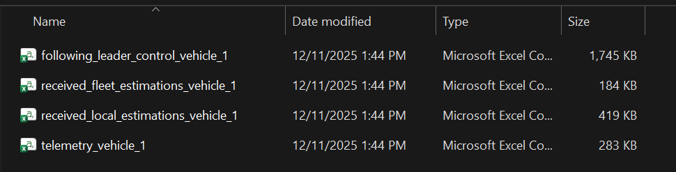
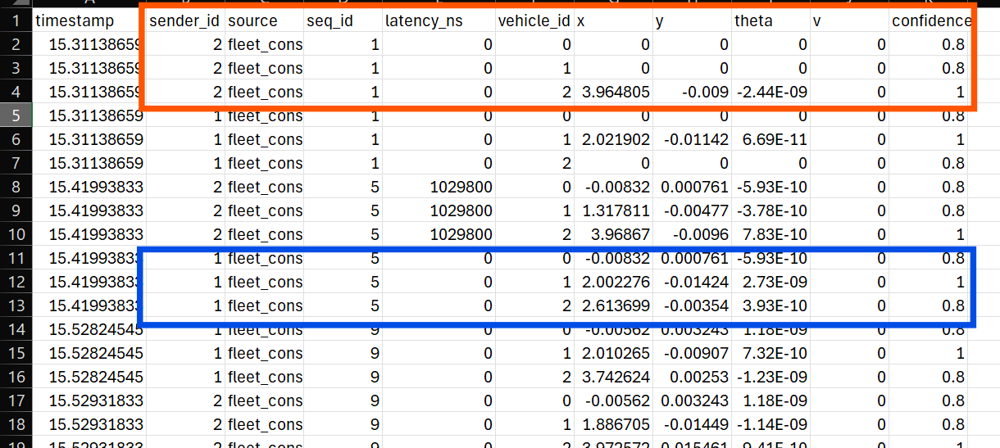
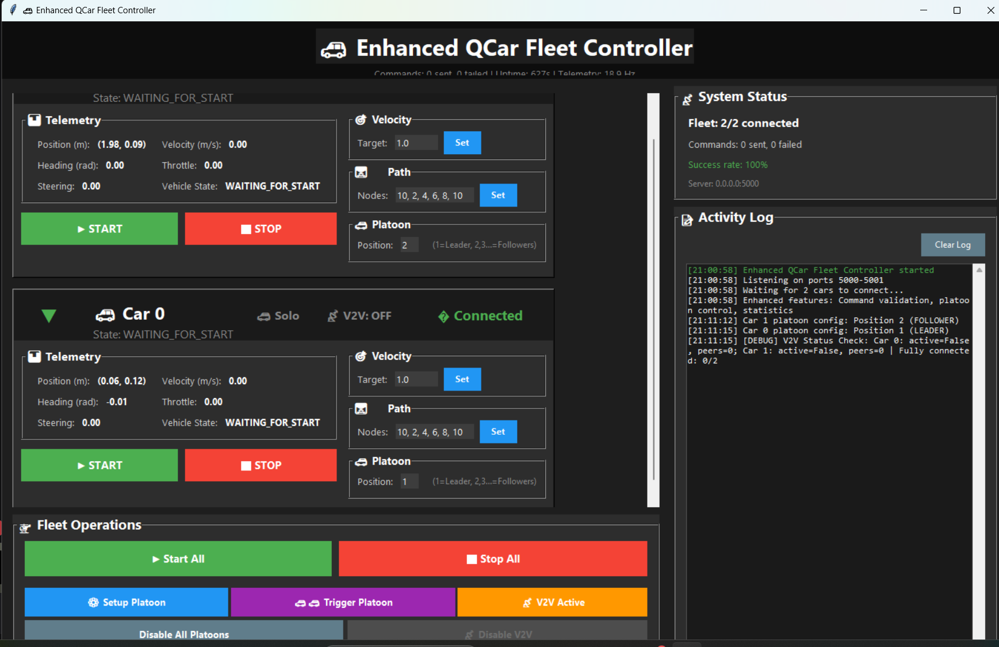

# QCar Multi-Vehicle Self-Driving System 

### ⚡ For real Qcar 

```powershell

Edit `config.txt` with your IPs , and the real car

#  Start GUI  (another cmd)
cd .\Development\multi_vehicle_self_driving_RealQcar\qcar\GUI\      
python .\app_main.py
# You can connect fully with the GUI 


# -----  OLDS stuff -------
# Start all vehicles (in another terminal)
cd .\Development\multi_vehicle_self_driving_RealQcar      

# .\start_refactored.bat 
.\start_enhanced.bat 
fleet_config.yaml is that file need to put correct IP adresse

(Wait its will run automatique)

# To Stop all vehicles (in same terminal of the start)
cd .\Development\multi_vehicle_self_driving_RealQcar      

.\stop_enhanced.bat   ## Stop all the python process (logic is shutdown) = stop_refactored
.\stop_all_cars.bat   ## Stop all physical part ( lidars  )

# For probing
python multi_probing.py --car 0

```

### For Simulation Qlabs
 
```powershell


# (In Simulator) # For spawn 2 Qcar
cd .\Development\QCar2_multi-vehicle_control\
python .\initCars.py     

#  Start GUI  (another cmd)
cd .\Development\multi_vehicle_self_driving_RealQcar\qcar\GUI\      
python .\app_main.py


# Run the real logic of vehicle 0   (another cmd)

cd .\Development\multi_vehicle_self_driving_RealQcar\qcar      
python .\vehicle_main.py --host 127.0.0.1 --port 5000 --car-id 0

# Run the real logic of vehicle 1 (another cmd) 

cd .\Development\multi_vehicle_self_driving_RealQcar\qcar      
python .\vehicle_main.py --host 127.0.0.1 --port 5000 --car-id 1

# Should enable probing in the Development\multi_vehicle_self_driving_RealQcar\qcar\fleet_config.yaml
# For probing
python multi_probing.py --car 0


(Logs file is in same folder (\Development\multi_vehicle_self_driving_RealQcar\qcar))
```


### For Calibration

# In separate terminal
```powershell
cd C:\Users\Quang Huy Nugyen\Desktop\PHD_paper\Simulation\QCAR\QCar2_Cran\Development\multi_vehicle_self_driving_RealQcar\qcar\Calibration\On_Track_SysID\src

python online_sysid_zmq_worker.py --sample-port 18880 --control-port 18881 --status-port 18882 --plot-model
```

### Development Quick Test Mode (Fake Vehicle use math equation like We do with Matlab)
```powershell
# Start GUI 

cd .\Development\multi_vehicle_self_driving_RealQcar\qcar\GUI     
python .\app_main.py


# Test with fake vehicles (no hardware , no Qlabs , math equation)
cd .\Development\multi_vehicle_self_driving_RealQcar\qcar\simulation    
python fake_vehicle_real_logic.py 0

# Test with fake vehicles (with parameter Qcar ) (no hardware , no Qlabs)
python fake_vehicle_real_logic.py 1


(Logs file is in same folder (GUI))
```
### LOGs files (Debug)
Each vehicle have at least 4 file 

And the fleet files like 



### UI Overview




Start All : If the vehicle is in state Waiting for start , you will run in Following path mode .

Stop All : Stop the car , go in Stop state
V2V Active : To activate the Comunication . Should see V2V On in each panel (2 Cars min)

Setup Platoon : You set up who leader , who follower in Platoon Panel , after click Setup Platoon button to send to all vehicle connected 

Trigger platoon : Leader will keep in state "Following path mode" , Followers will go to "Follwoer Leader mode" 

## 🔧 Configuration

Edit `config.txt` for your network:

```txt
QCAR_IPS=[192.168.137.102 , 192.168.137.208]
LOCAL_IP=192.168.137.1
REMOTE_PATH=/home/nvidia/Documents/multi_vehicle_RealCar
```


# Quick Start — Limo System

## Architecture

```
SDCQcar  ──static TF──▶  map  ──▶  odom  ──▶  base_link
 (QCar world)            (ROS world)
```

- **SDCQcar**: SDCSRoadMap coordinates (waypoints, QCar logic)
- **map**: AMCL / Nav2 / RViz (normal ROS)
- One static TF connects them — defined in the launch file


## Step 2 — Rebuild after calibration
# Rebuild only limo_nav_huy_test
```bash
cd ~/agilex_ws
colcon build --packages-select limo_nav_huy_test --symlink-install
source install/setup.bash
```

# Rebuild all packages necessaires
colcon build --packages-select limo_base limo_bringup limo_nav_huy_test --symlink-install

---
## Step 3 — Run the full system (new)

### Terminal 0 — Start the robot
```bash
ros2 launch limo_bringup limo_start.launch.py
```
# Terminal 1 (without vehicle_main)
```bash
ros2 launch limo_nav_huy_test navigationV2V_qcar_frames.launch.py start_vehicle_main:=false
```

# Terminal 2 (vehicle_main separate)
```bash
ros2 run limo_nav_huy_test vehicle_main_ros_qcar
```

### Terminal 3 — (Optional) RViz
```bash
ros2 run rviz2 rviz2 -d ~/agilex_ws/install/limo_nav_huy_test/share/limo_nav_huy_test/rviz/nav2_copy.rviz
```

# Terminal 4  -  (Optional) 
Send an SDC pose to trigger AMCL init (acts like RViz 2D Pose Estimate):

```bash
ros2 topic pub --once /initialpose_sdc geometry_msgs/msg/PoseStamped \
"{header: {frame_id: SDCQcar}, pose: {position: {x: -1.28205, y: -0.45991, z: 0.0}, orientation: {x: 0.0, y: 0.0, z: -0.358, w: 0.934}}}"
```


