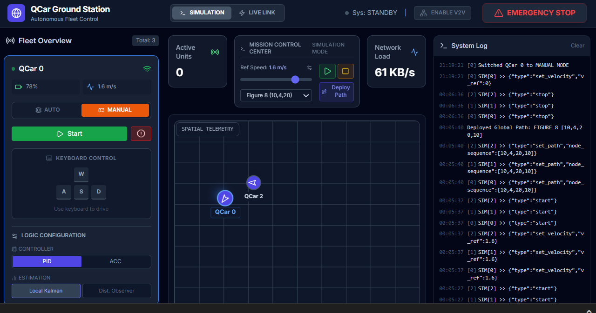

# QCar Multi-Vehicle Self-Driving System 

### ⚡ For real Qcar 

```powershell

Edit `config.txt` with your IPs , and the real car

# Start GUI (in another terminal)
cd .\Development\multi_vehicle_self_driving_RealQcar\qcar\GUI\      
python .\enhanced_gui_controller.py

# Start all vehicles (in another terminal)
cd .\Development\multi_vehicle_self_driving_RealQcar      

.\start_refactored.bat 


(Wait its will run automatique)

# To Stop all vehicles (in same terminal of the start)
cd .\Development\multi_vehicle_self_driving_RealQcar      

.\stop_enhanced.bat   ## Stop all the python process (logic is shutdown) = stop_refactored
.\stop_all_cars.bat   ## Stop all physical part ( lidars  )

```

### For Simulation Qlabs
 
```powershell


# (In Simulator) # For spawn 2 Qcar
cd .\Development\QCar2_multi-vehicle_control\
python .\initCars.py     

#  Start GUI  (another cmd)
cd .\Development\multi_vehicle_self_driving_RealQcar\qcar\GUI\      
python .\enhanced_gui_controller.py

# Run the real logic of vehicle 0   (another cmd)

cd .\Development\multi_vehicle_self_driving_RealQcar\qcar      
python .\vehicle_main.py --host 127.0.0.1 --port 5000 --car-id 0

# Run the real logic of vehicle 1 (another cmd) 

cd .\Development\multi_vehicle_self_driving_RealQcar\qcar      
python .\vehicle_main.py --host 127.0.0.1 --port 5000 --car-id 1

```


### Development Quick Test Mode (UI)
```powershell
# Start GUI 

cd .\Development\multi_vehicle_self_driving_RealQcar\qcar\GUI\      
python .\enhanced_gui_controller.py

# Test with fake vehicles (no hardware , no Qlabs)
cd .\Development\multi_vehicle_self_driving_RealQcar\qcar\GUI\    
python fake_vehicle_real_logic.py 0
```


Start All : If the vehicle is in state Waiting for start , you will run in Following path mode .
Stop All : Stop the car , go in Stop state
V2V Active : To activate the Comunication . Should see V2V On in each panel (2 Cars min)

Setup Platoon : You set up who leader , who follower in Platoon Panel , after click Setup Platoon button to send to all vehicle connected 

Trigger platoon : Leader will keep in state "Following path mode" , Followers will go to "Follwoer Leader mode" 

## 🔧 Configuration

Edit `config.txt` for your network:

```txt
QCAR_IPS=[192.168.137.102 , 192.168.137.208]
LOCAL_IP=192.168.137.1
REMOTE_PATH=/home/nvidia/Documents/multi_vehicle_RealCar
```


## 🛠️ System Architecture

### Refactored Improvements
- ✅ **Configuration**: YAML/JSON files instead of hardcoded values
- ✅ **State Machine**: Proper state management vs boolean flags
- ✅ **Safety**: Multi-layered safety systems
- ✅ **Logging**: Structured logging + telemetry
- ✅ **Network**: Robust communication with retry logic
- ✅ **Deployment**: Automated startup/shutdown

### State Flow
```
INITIALIZING → WAITING_FOR_START → FOLLOWING_PATH ⇄ FOLLOWING_LEADER
                      ↑                   ↓               ↓
                      ←──────────── STOPPED ←─────────────┘
```


## 🚀 Next Steps
0. Fix multiproing class to see all the cameras of each vehicle conntected
1. Refactory the code 
2. Use platoon controller 
3. Can connected to Qlabs
4. Implement the observer developed 
5. New GUI ?? 

---


**Platform**: Windows + QCar Hardware


