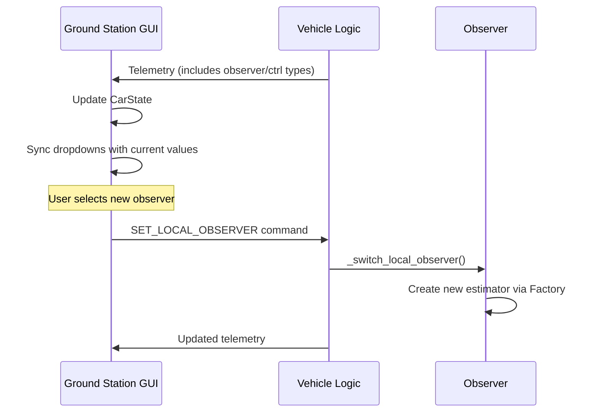

# QCar System Structure and Communication Documentation

This document describes the internal structure and communication architecture of the QCar multi-vehicle self-driving system, based on the analysis of key components.


## 4. Data Types & Structures

### A. Local Data Structures

| **Data Structure** | **Type** | **Description** | **Key Fields** |
| :--- | :--- | :--- | :--- |
| **`sensor_data`** | `Dict[str, Any]` | Input to State Machine and Observers | `x`, `y`, `theta`, `velocity`, `motor_tach`, `gyro_z`, `gps_valid`, `yolo_data` |
| **`state_info`** | `Dict[str, float]` | Fused state estimation used for control | `x`, `y`, `theta`, `velocity`, `fleet_states` |
| **`vis_data`** | `Dict` | Data for Visualization/Scopes | `x_gps`, `y_gps`, `v_ref`, `steering`, `throttle`, `consensus_error` |

### B. Communication Data Structures

#### 1. Telemetry Payload (Vehicle $\rightarrow$ GS)

**Transport**: JSON over TCP (10Hz)

```json
{
    "timestamp": 1705678901.123,     // time [s]
    "time": 45.2,                    // elapsed [s]
    "x": 1.25,                       // [m]
    "y": -0.5,                       // [m]
    "th": 0.1,                       // [rad]
    "v": 0.8,                        // [m/s]
    "u": 0.15,                       // throttle [-1,1]
    "delta": -0.05,                  // steering [rad]
    "v_ref": 1.0,                    // [m/s]
    "state": "LANE_FOLLOWING",       // State Name
    "gps_valid": true,
    "v2v_active": true,
    "v2v_peers": 2
}
```

#### 2. Scope Data Packet (Vehicle $\rightarrow$ GS)

**Transport**: Hex-Encoded Binary in JSON (>20Hz)

*   **JSON Wrapper**: `{"type": "scope_data", "payload": "<HEX_STRING>"}`
*   **Binary Payload** (Big-Endian `!`):

| **Field** | **Type** | **Size** | **Description** |
| :--- | :--- | :--- | :--- |
| Header | `uint8` | 1 | Magic Byte `0xAB` |
| Car ID | `uint8` | 1 | Vehicle Identifier |
| Timestamp | `double` | 8 | Sample time [s] |
| Num Fields | `uint8` | 1 | Number of data points ($N$) |
| Data | `float` x $N$ | $N \times 4$ | Array of float32 values |

#### 3. Command Payload (GS $\rightarrow$ Vehicle)

**Transport**: JSON over TCP

```json
{
    "command": "START",              // CommandType Enum
    "source": "ground_station",      // Source ID
    "type": "enable_platoon",        // Alternative Key
    "role": "leader",                // Optional Args
    "params": { ... }                // Parameter Dict
}
```

#### 4. V2V Broadcast Packet (UDP)

**Transport**: UDP Broadcast
**Format**: JSON-encoded `V2VMessage`

**Common Header**:
```json
{
    "sender_id": 1,
    "message_type": "local_state", // or "fleet_state", "intent", etc.
    "seq_id": 101,
    "send_time_ns": 1705678901123456789,
    "data": { ... } // Payload varies by message_type
}
```

**Payloads**:

**a. Local State (`local_state`)** - High Frequency (~20Hz)
*   **Description**: The broadcasting vehicle's own estimated state.
```json
{
    "vehicle_id": 1,
    "x": 1.25,               // [m]
    "y": -0.5,               // [m]
    "theta": 0.1,            // [rad]
    "velocity": 0.8,         // [m/s]
    "acceleration": 0.05,    // [m/s^2] (Optional)
    "confidence": 1.0,       // [0-1]
    "control_input": {       // (Optional)
        "steering": 0.1,
        "throttle": 0.2
    },
    "source": "local_sensors"
}
```

**b. Fleet State (`fleet_state`)** - Medium Frequency (~5Hz)
*   **Description**: A consensus or aggregated view of other vehicles' states as seen by the sender.
```json
{
    "sender_id": 1,
    "source": "fleet_consensus",
    "fleet_states": {
        "2": {  // Key is vehicle_id of the observed vehicle
            "x": 3.5,
            "y": -0.4,
            "theta": 0.12,
            "velocity": 0.82,
            "confidence": 0.95
        },
        "3": {
            "x": 6.1,
            "y": -0.3,
            "theta": 0.11,
            "velocity": 0.81,
            "confidence": 0.90
        }
    }
}
```

## 1. System Overview

The system controls autonomous QCar vehicles using a centralized `VehicleLogic` controller that orchestrates:
-   **Communication**: Ground Station (TCP) and Vehicle-to-Vehicle (UDP).
-   **State Estimation**: Sensor fusion and fleet observation.
-   **Control**: State machine-based logic and platooning.
-   **Visualization**: Real-time scope data streaming and local plotting.

## 2. Component Internal Structure

### A. Central Controller (`vehicle_logic.py`)
**Class**: `VehicleLogic`
-   **Role**: The "brain" of the vehicle. Integrates all subsystems.
-   **Key Components**:
    -   `state_machine`: Handles high-level logic (Initializing, Idle, LaneFollowing, etc.).
    -   `vehicle_observer`: Manages local (EKF) and fleet state estimation.
    -   `command_handler`: Processes incoming commands.
    -   `v2v_manager`: Handles inter-vehicle communication.
    -   `client_Ground_Station`: Manages TCP connection to the dashboard.
    -   `scope_manager`: Handles data recording and visualization.
-   **Execution Loop**:
    1.  **Sensor Update**: Reads QCar hardware and YOLO data.
    2.  **Observer Update**: Fuses data to estimate state ($x, y, \theta, v$).
    3.  **Control Logic**: Queries state machine for steering/throttle ($u, \delta$).
    4.  **Communication**: Sends telemetry (10Hz) and V2V broadcasts.
    5.  **Visualization**: Updates local scopes or streams data to GS.

### B. Communication Handler (`ground_station_client.py`)
**Class**: `GroundStationClient`
-   **Role**: Manages high-performance TCP communication with the Ground Station.
-   **Architecture**:
    -   **Thread**: Single background thread `_communication_loop` for I/O.
    -   **Queues**:
        -   `telemetry_queue`: Low-frequency state updates (JSON).
        -   `scope_data_queue`: High-frequency binary/hex data for plotting (Prioritized).
        -   `command_queue`: Incoming commands from GS.
-   **Protocol**:
    -   **Format**: Newline-delimited JSON messages.
    -   **Scope Data**: Binary data is hex-encoded and wrapped in JSON payload for transport.
    -   **Reliability**: Auto-reconnection logic (10s timeout on failure).

### C. Command Processing (`command_handler.py`)
**Class**: `CommandHandler`
-   **Role**: Decouples network reception from execution logic.
-   **Mechanism**: Event-driven dispatch.
-   **Flow**:
    1.  Raw dict received from `GroundStationClient`.
    2.  Parsed into `CommandInfo` (Type + Data).
    3.  Dispatched via `EventDispatcher` to the active State in `VehicleStateMachine`.
    4.  State decides whether to transition (e.g., `STOP` -> `IDLE`) or execute action (e.g., `SET_PARAM`).

### D. Visualization & Scopes
**Local Side (`estimation_scopes.py`)**:
-   **Class**: `EstimationScopeManager`
-   **Role**: Plug-and-play visualization system.
-   **Features**:
    -   **Presets**: Pre-configured plots (`LocalStatePreset`, `FleetPositionPreset`).
    -   **Modes**:
        -   **Live**: Uses `MultiScope` (matplotlib/pyqt) to show plots on the vehicle/sim.
        -   **Headless**: Records data to CSV via `ScopeDataRecorder` for offline analysis.
    -   **Data Player**: Can replay CSV files for debugging.

**Remote Side (`remote_scope_manager.py`)**:
-   **Class**: `RemoteScopeManager` (Runs on Ground Station)
-   **Role**: Receives and visualizes real-time high-frequency data from vehicles.
-   **Architecture**:
    -   **Multiprocessing**: Spawns separate processes for Matplotlib windows to avoid freezing the GUI.
    -   **Ring Buffers**: `ScopeDataBuffer` stores recent history for smooth scrolling.
    -   **Data Flow**: Hex String -> Decode -> Unpack -> Buffer -> Plot Process.

## 3. Communication Architecture

### A. Vehicle $\leftrightarrow$ Ground Station (TCP/IP)
*   **Connection**: Persistent TCP Socket.
*   **Direction**: Bidirectional.
*   **Vehicle to GS**:
    *   **Telemetry**: Low-frequency (10Hz) status (Position, Battery, Mode).
    *   **Scope Data**: High-frequency (<50Hz) raw signal streams for remote plotting.
*   **GS to Vehicle**:
    *   **Commands**: JSON objects (e.g., `{'command': 'START', 'source': 'user'}`).

### B. Vehicle $\leftrightarrow$ Vehicle (UDP Broadcast)
*Managed by `V2VManager` (referenced in `vehicle_logic.py`)*
*   **Connection**: UDP Broadcast (send) / Multicast or Unicast (receive).
*   **Rates**:
    *   **Local State**: High freq (25Hz) for platoon stability.
    *   **Fleet State**: Lower freq (10Hz) for forwarding known peers.
    *   **Heartbeat**: Low freq (1Hz) for discovery.
*   **Data**: Position, Velocity, Leader ID, Platoon Status.

### C. Internal Data Flow
1.  **Incoming**:
    `GroundStationClient` (Network) $\rightarrow$ `CommandHandler` (Logic) $\rightarrow$ `VehicleStateMachine` (Decision).
2.  **Outgoing**:
    `VehicleObserver` (Estimates) $\rightarrow$ `VehicleLogic` (Packaging) $\rightarrow$ `GroundStationClient` (Transmission).
3.  **Visualization**:
    `VehicleObserver` (States) $\rightarrow$ `EstimationScopeManager` $\rightarrow$ LCD Display or CSV File.
<!-- ---

--- -->