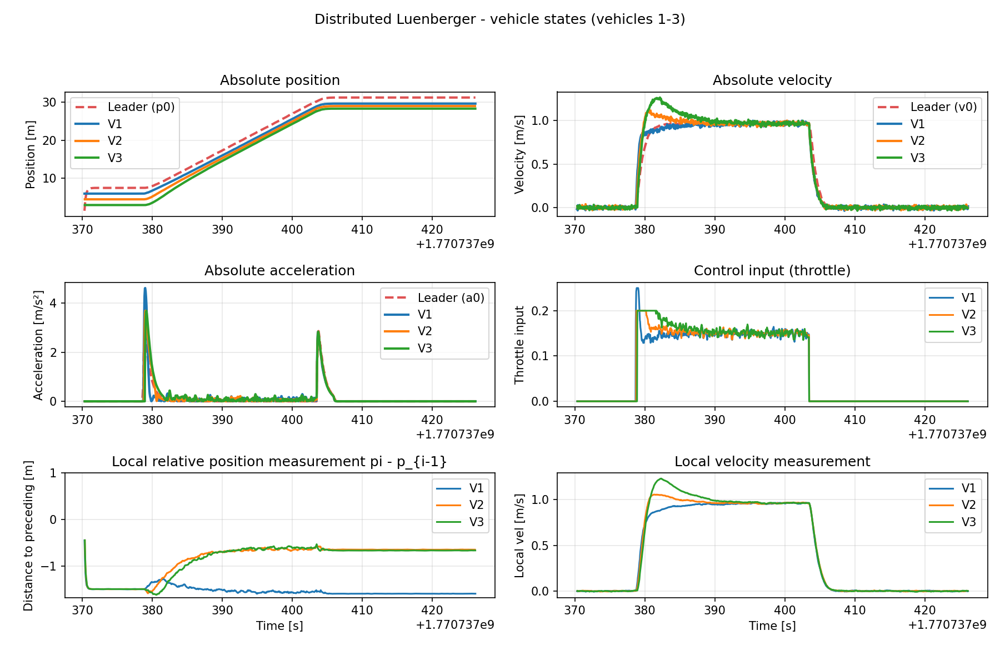
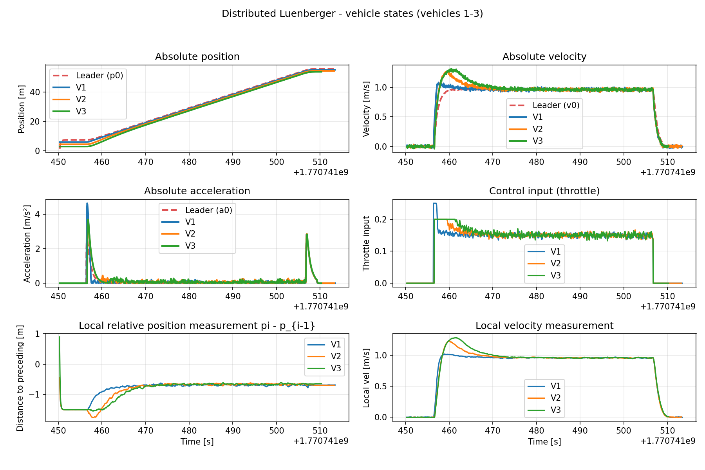

# Steady-State Gap Error Analysis for State Feedback Controller (No Observer)
# 状态反馈控制器（无观测器）稳态间距误差分析

**Date / 日期**: 2026-02-10  
**Controller / 控制器**: `StateFeedbackControllerNoObserver`  
**File / 文件**: `state_feedback_controller_no_observer.py`

---

## Experimental Result / 实验结果



---

## 1. Problem Statement / 问题描述

**EN**: The steady-state gap between Vehicle 1 and the Leader (~1.6m) is significantly larger than the desired spacing (~0.7m), while inter-vehicle gaps between followers (V1→V2, V2→V3) appear correct (~0.7m).

**CN**: 稳态时 Vehicle 1 与 Leader 的间距（约1.6m）远大于期望间距（约0.7m），而 followers 之间的间距（V1→V2, V2→V3）却接近正确值（约0.7m）。

---

## 2. Control Law Analysis / 控制律分析

### 2.1 Vehicle 1's Control Law / Vehicle 1 的控制律

For Vehicle 1, the control law reduces to a single term:

$$u_1 = K_{10} \cdot F_1 \cdot \hat{x} = K_{10} \begin{bmatrix} p_1 - p_0 + d_{10} \\ v_1 - v_0 \\ a_1 - a_0 \end{bmatrix}$$

where $K_{10} = [-0.1729, -0.4856, -0.0746]$

**EN**: Vehicle 1 has NO predecessor coupling term (unlike V2 and V3), making it a simple proportional controller relative to the leader only.

**CN**: Vehicle 1 没有前车耦合项（不像 V2 和 V3），使其成为仅参考 leader 的简单比例控制器。

### 2.2 Desired Spacing / 期望间距

$$d_{10} = d + h \cdot v_1 = 0.4 + 0.3 \times v_1$$

At steady state with $v_1 \approx 1$ m/s:

$$d_{10} = 0.4 + 0.3 \times 1 = 0.7 \text{ m}$$

---

## 3. Root Cause: Proportional Controller Steady-State Error / 根本原因：比例控制器稳态误差

### 3.1 The Problem / 问题所在

**EN**: Real vehicles require non-zero throttle ($u^{ss} \approx 0.16$) to maintain constant velocity (overcoming friction, drag, etc.). Since the controller has **no integral term**, it must "borrow" position error to generate this throttle.

**CN**: 实际车辆需要非零油门（$u^{ss} \approx 0.16$）来维持匀速（克服摩擦、阻力等）。由于控制器**没有积分项**，它必须"借用"位置误差来产生这个油门。

### 3.2 Mathematical Derivation / 数学推导

At steady state: $v_1 = v_0$, $a_1 = a_0 = 0$. Only the position term remains:

$$u_1^{ss} = K_{10}[0] \cdot (p_1 - p_0 + d_{10})$$

Solving for the actual gap:

$$p_1 - p_0 + d_{10} = \frac{u_1^{ss}}{K_{10}[0]} = \frac{0.16}{-0.1729} = -0.925 \text{ m}$$

$$p_1 - p_0 = -0.925 - 0.7 = -1.625 \text{ m}$$

**EN**: This matches the observed ~1.6m gap in simulation perfectly!

**CN**: 这与仿真中观察到的约 1.6m 间距完全吻合！

### 3.3 Error Breakdown / 误差分解

| | Desired Gap / 期望间距 | Steady-State Error / 稳态误差 | Actual Gap / 实际间距 |
|---|---|---|---|
| **V1 → Leader** | 0.7m | +0.925m | **1.625m** |
| **V2 → Leader** | 1.4m | +0.906m | 2.306m |
| **V3 → Leader** | 2.1m | +0.844m | 2.944m |

---

## 4. Why Inter-Vehicle Gaps Look Correct / 为什么 follower 之间间距看起来正常

**EN**: ALL followers have approximately the same steady-state error (~0.9m), because they share similar controller gains $K_{i0}$. The inter-vehicle gap shows the **difference** of two errors, which nearly cancels out.

**CN**: 所有 followers 都有近似相同的稳态误差（约0.9m），因为它们共享相似的控制增益 $K_{i0}$。inter-vehicle gap 显示的是两个误差的**差值**，差值几乎为零。

```
Leader ──── 1.6m ────── V1 ──── 0.7m ────── V2 ──── 0.7m ────── V3
             ^                    ^                    ^
         desired 0.7m         desired 0.7m         desired 0.7m
         error +0.9m          error ≈ 0m           error ≈ 0m
```

$$\text{gap}(V2 \to V1) = (p_2 - p_0) - (p_1 - p_0) = (-2.306) - (-1.625) = -0.681 \text{m} \approx -0.7 \text{m}$$

**EN**: The errors cancel: $0.925 - 0.906 = 0.019$ m ≈ 0. Only the Leader→V1 gap exposes the full error, because the leader has no controller lag.

**CN**: 误差相消：$0.925 - 0.906 = 0.019$ m ≈ 0。只有 Leader→V1 的间距暴露了全部误差，因为 leader 没有控制器延迟。

---

## 5. Additional Contributing Factor: Asymmetric Braking / 附加因素：不对称制动

```python
# Current code / 当前代码
if throttle_raw < 0:
    smoothing_factor = 0.85
    throttle_raw = max(smoothing_factor * prev + (1 - smoothing_factor) * throttle_raw, 0.0)
```

**EN**: Negative throttle is clamped to 0, meaning the controller cannot actively brake. Combined with heavy smoothing (0.85), deceleration is extremely sluggish compared to acceleration, further biasing V1's gap to be larger.

**CN**: 负油门被钳位到0，意味着控制器无法主动制动。加上沉重的平滑因子（0.85），减速比加速慢得多，进一步导致 V1 间距偏大。

---

## 6. Proposed Solutions / 解决方案

### Option A: Feedforward Compensation / 前馈补偿 (Recommended / 推荐)

**EN**: Estimate the base throttle needed to maintain current velocity, so the state feedback only handles error correction.

**CN**: 估算维持当前速度所需的基础油门，状态反馈仅负责误差修正。

$$u_i = u_{ff}(v_i) + K_{i0} \cdot F_i \cdot \hat{x} + \sum_{j=1}^{i-1} K_{ij}(F_i - F_j)\hat{x}$$

Where $u_{ff}(v)$ is a velocity-to-throttle mapping learned from data or system identification.

### Option B: Integral Term / 积分项

**EN**: Add integral action on position error to eliminate steady-state offset.

**CN**: 在位置误差上加积分项消除稳态偏差。

$$u_i = K_{i0} \cdot F_i \cdot \hat{x} + K_I \int (p_i - p_0 + d_{i0}) \, dt$$

### Option C: Allow Negative Throttle / 允许负油门

**EN**: Remove the non-negative clamp and reduce smoothing to improve symmetric response.

**CN**: 移除非负钳位并降低平滑系数以改善对称响应。

---

## 7. Summary / 总结

| Factor / 因素 | Impact / 影响 |
|---|---|
| **No integral term** / 无积分项 | Main cause: ~0.9m steady-state error on ALL vehicles / 主因：所有车辆约 0.9m 稳态误差 |
| **No feedforward** / 无前馈 | Controller uses position error to generate maintenance throttle / 控制器用位置误差产生维持油门 |
| **Asymmetric braking** / 不对称制动 | V1 cannot actively brake, increasing gap further / V1 无法主动制动，进一步拉大间距 |
| **Error cancellation** / 误差相消 | Inter-vehicle gaps hide the problem / follower 间距掩盖了问题 |

**EN**: The ~1.6m gap is NOT a bug in V1 specifically — it's a fundamental limitation of a proportional-only controller on a system with friction. All vehicles have the same error, but only V1→Leader exposes it.

**CN**: 约 1.6m 的间距不是 V1 特有的 bug —— 这是比例控制器在有摩擦系统上的基本局限。所有车辆都有相同的误差，但只有 V1→Leader 暴露了它。


## Choose the Option A: Feedforward Compensation / 选择方案 A：前馈补偿

Now the results look much better, with V1→Leader gap reduced to ~0.7m and inter-vehicle gaps still correct.



