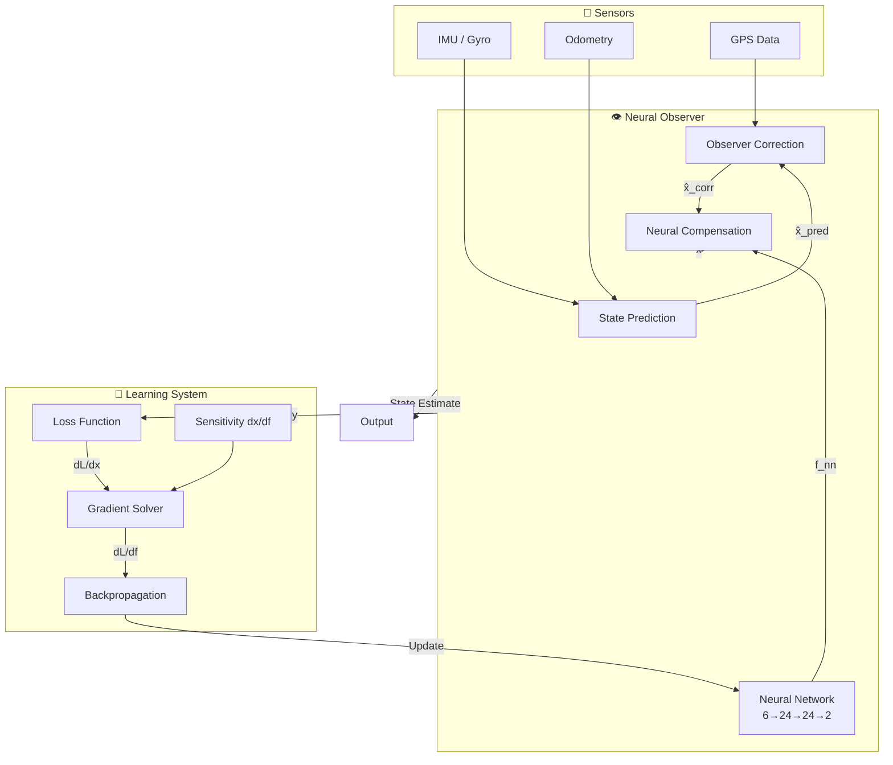

# Neural Network-Enhanced Local Observer

> A Luenberger observer enhanced with neural network learning for adaptive vehicle state estimation

---

## Introduction

This module implements an advanced state estimation system that combines **Luenberger Observer** with **Neural Network learning** to achieve robust state tracking for autonomous vehicles. The system addresses model uncertainties—particularly tire force nonlinearities—by using a gradient-based learning approach to train a neural network that compensates for unknown dynamics.

The core innovation lies in the **observer-augmented learning framework**: a state observer estimates vehicle states while the neural network learns unmodeled disturbances, creating a synergistic system that improves both estimation and control performance over time.

### Problem Statement

Traditional observers rely on accurate vehicle models, but real-world dynamics include:
- **Nonlinear tire forces** that vary with road conditions
- **Plant-model mismatch** from simplified vehicle models  
- **Unknown disturbances** affecting vehicle motion

This framework addresses these challenges through online neural network adaptation.

---

## Key Features

| Feature | Description |
|---------|-------------|
| 🚗 **Luenberger Observer** | Classical state estimation with correction gains |
| 🧠 **Neural Network Learning** | Learns unknown tire forces and disturbances online |
| 📈 **Gradient-Based Training** | Sensitivity-based backpropagation through dynamics |
| 🔄 **Multiple Learning Modes** | Basic, continuous, and dictionary-based learning strategies |
| 💾 **Model Persistence** | Save/load trained models for reuse |
| 🔌 **Seamless Integration** | Compatible with existing `LocalStateEstimatorBase` interface |

### Learning Modes

1. **Normal Basic** — Standard gradient descent updating
2. **Continuous Learning** — Model queue with weighted predictions  
3. **Dictionary-Based Learning** — Experience replay with feature storage

---

## Overall Architecture



### Observer Equation

The neural-enhanced observer follows:

```
x̂[k+1] = A·x̂[k] + B·u[k] + K·(y[k] - C·x̂[k]) + D·f_nn[k]
```

Where:
- `x̂`: Estimated state `[x, y, θ, v]`
- `u`: Control input `[δ, a]` (steering, throttle)
- `y`: Measurement from sensors
- `K`: Observer gain matrix
- `f_nn`: Neural network output (learned disturbance compensation)
- `D`: Disturbance input matrix

### Gradient Propagation

Sensitivity propagates through observer dynamics:

```
dx/df[k+1] = (A + K·C) · dx/df[k] + D
```

Chain rule for gradient:

```
dL/df = dL/dx · dx/df
```

---

## File Structure

### Core Files

| File | Purpose |
|------|---------|
| [`neural_network.py`](file:///c:/Users/Quang%20Huy%20Nugyen/Desktop/PHD_paper/Simulation/QCAR/QCar2_Cran/Development/multi_vehicle_self_driving_RealQcar/qcar/Observer/LocalNeuralObs/neural_network.py) | Neural network architecture with spectral normalization |
| [`gradient_solver.py`](file:///c:/Users/Quang%20Huy%20Nugyen/Desktop/PHD_paper/Simulation/QCAR/QCar2_Cran/Development/multi_vehicle_self_driving_RealQcar/qcar/Observer/LocalNeuralObs/gradient_solver.py) | Gradient computation and chain rule implementation |
| [`neural_state_estimator.py`](file:///c:/Users/Quang%20Huy%20Nugyen/Desktop/PHD_paper/Simulation/QCAR/QCar2_Cran/Development/multi_vehicle_self_driving_RealQcar/qcar/Observer/LocalNeuralObs/neural_state_estimator.py) | Main estimator class integrating observer and learning |

### Module Details

#### `neural_network.py` — Neural Network

**Network Architecture:**
- **Input**: 6 dimensions `[v_x, v_y, ψ, ψ̇, δ, a]`
- **Hidden**: 24 neurons × 2 layers (SiLU activation)
- **Output**: 2 dimensions `[f_f, f_r]` (tire force compensation)

**Key Classes:**
- `NeuralObserverNet`: Main neural network with spectral normalization
- `LearningBatch`: Experience replay buffer for dictionary-based learning
- `ModelQueue`: Queue of models for continuous learning

---

#### `gradient_solver.py` — Gradient Solver

**Key Methods:**
- `gradient_solver_discrete()`: Update sensitivity for discrete-time observer
- `chain_rule_reference_tracking()`: Gradient for reference tracking loss
- `chain_rule_measurement_tracking()`: Gradient for measurement-based loss
- `chain_rule_full_measurement()`: Gradient using true unknown forces

**Gradient Propagation:**
```
dx/df[k+1] = (A + K·C) · dx/df[k] + D
```

---

#### `neural_state_estimator.py` — Neural Observer

**Main Class:** `NeuralLuenbergerEstimator`

Extends `LocalStateEstimatorBase` with:
- Neural network integration
- Online gradient-based learning
- Multiple learning modes
- Model persistence

---

## Configuration

Configuration is managed through [`config_local_estimators.yaml`](file:///c:/Users/Quang%20Huy%20Nugyen/Desktop/PHD_paper/Simulation/QCAR/QCar2_Cran/Development/multi_vehicle_self_driving_RealQcar/qcar/Observer/config_local_estimators.yaml):

```yaml
local_estimator_type: neural_luenberger

local:
  neural_luenberger:
    # Neural network architecture
    input_dim: 6
    hidden_dim: 24
    output_dim: 2
    
    # Training parameters
    learning_rate: 0.005
    batch_size: 3
    weight_decay: 0.0
    
    # Observer parameters
    observer_gain: 0.5
    sample_time: 0.02
    
    # Loss function configuration
    loss_type: 'measurement_full'
    weight_vx: 10
    weight_vy: 20000
    weight_psi: 10
    weight_psi_dot: 20000
    lambda_regularization: 0.0
    
    # Learning mode
    learning_mode: 'learningby_dict'
    dict_size: 20
    
    # Model persistence
    model_path: 'trained_data/neural_observer_model.pt'
    load_pretrained: false
```

### Configuration Parameters

| Parameter | Default | Description |
|-----------|---------|-------------|
| `input_dim` | 6 | Neural network input dimension |
| `hidden_dim` | 24 | Hidden layer size |
| `output_dim` | 2 | Output dimension (tire forces) |
| `learning_rate` | 0.005 | Adam optimizer learning rate |
| `batch_size` | 3 | Gradient accumulation steps |
| `observer_gain` | 0.5 | Luenberger observer gain |
| `loss_type` | `measurement_full` | Loss function type |
| `learning_mode` | `learningby_dict` | Learning strategy |
| `dict_size` | 20 | Experience replay buffer size |

### Loss Function Types

- **`refs`**: Reference tracking loss (requires trajectory)
- **`measurement_small`**: Partial measurement tracking (position only)
- **`measurement_full`**: Full state measurement tracking (recommended)

---

## Usage

### Basic Usage

```python
from qcar.Observer.local_state_estimators import LocalEstimatorFactory

# Create neural observer
config = {
    'learning_rate': 0.005,
    'batch_size': 3,
    'learning_mode': 'learningby_dict'
}

estimator = LocalEstimatorFactory.create(
    estimator_type='neural_luenberger',
    initial_pose=np.array([0, 0, 0]),
    config=config,
    logger=logger
)

# Update loop
for step in range(num_steps):
    # Update with sensor data
    success = estimator.update(
        motor_tach=velocity,
        steering=steering_angle,
        throttle=throttle_cmd,
        dt=0.02,
        gyro_z=yaw_rate,
        gps_data={'x': x, 'y': y, 'theta': theta, 'valid': True}
    )
    
    # Get state estimate
    state = estimator.get_state()  # [x, y, theta, v]
```

### Save Trained Model

```python
# Save model after training
estimator.save_model('trained_data/my_neural_observer.pt')
```

### Load Pretrained Model

```python
# Configure to load pretrained model
config = {
    'model_path': 'trained_data/my_neural_observer.pt',
    'load_pretrained': True
}

estimator = LocalEstimatorFactory.create(
    estimator_type='neural_luenberger',
    config=config
)
```

### Monitor Training Progress

```python
# Get loss history
loss_history = estimator.get_loss_history()

# Plot training progress
import matplotlib.pyplot as plt
plt.plot(loss_history)
plt.xlabel('Training Steps')
plt.ylabel('Loss')
plt.title('Neural Observer Training Progress')
plt.show()
```

---

## Integration with Current System

The neural observer integrates seamlessly with the existing observer framework:

1. **Factory Pattern**: Use `LocalEstimatorFactory.create()` with `estimator_type='neural_luenberger'`
2. **Common Interface**: Implements `LocalStateEstimatorBase` interface
3. **Configuration**: Configured through `config_local_estimators.yaml`
4. **Lazy Loading**: PyTorch dependency only loaded when neural estimator is used

### Example Integration in VehicleObserver

```python
# In vehicle_observer.py or similar
from qcar.Observer.local_state_estimators import LocalEstimatorFactory

# Load configuration
config = load_yaml('config_local_estimators.yaml')
estimator_type = config.get('local_estimator_type', 'ekf')

# Create estimator (automatically handles neural_luenberger)
self.local_estimator = LocalEstimatorFactory.create(
    estimator_type=estimator_type,
    initial_pose=initial_pose,
    config=config.get('local', {}).get(estimator_type, {}),
    logger=self.logger
)
```

---

## Dependencies

```
numpy
torch  # PyTorch for neural network
scipy  # For integration (if using RK4)
```

Install PyTorch:
```bash
pip install torch
```

> [!NOTE]
> The neural estimator uses lazy loading, so PyTorch is only required if you actually use `neural_luenberger`. Other estimators work without PyTorch.

---

## Comparison with Old System

### Improvements

| Aspect | Old System | New System |
|--------|-----------|------------|
| **Integration** | Standalone script | Seamless integration with observer framework |
| **Configuration** | Hardcoded parameters | YAML-based configuration |
| **Interface** | Custom implementation | Implements `LocalStateEstimatorBase` |
| **Dependencies** | Always requires PyTorch | Lazy loading (optional dependency) |
| **Modularity** | Monolithic file | Separate modules for network, gradient, estimator |
| **Reusability** | Difficult to reuse | Easy to instantiate and configure |

### Maintained Features

- ✅ 3-layer neural network with spectral normalization
- ✅ Gradient-based learning through observer dynamics
- ✅ Multiple learning modes (basic, continuous, dictionary)
- ✅ Experience replay for improved learning
- ✅ Model save/load functionality

---

## Troubleshooting

### Import Error: torch not found

**Solution**: Install PyTorch
```bash
pip install torch
```

### Model not learning / Loss not decreasing

**Possible causes:**
1. Learning rate too low → Increase `learning_rate` in config
2. Batch size too small → Increase `batch_size`
3. Weight matrix not tuned → Adjust `weight_vx`, `weight_vy`, etc.
4. Insufficient data → Ensure GPS data is valid and frequent

### State estimates diverging

**Possible causes:**
1. Observer gain too high → Reduce `observer_gain`
2. Neural compensation too aggressive → Check `f_nn` values
3. Gradient explosion → Reduce `learning_rate`

---

## License

Based on work by Mark Misin. Code can be freely used and distributed. Original copyright labels must be preserved.

---

## References

- Original implementation: [`olds/README_MPC_Neural.md`](file:///c:/Users/Quang%20Huy%20Nugyen/Desktop/PHD_paper/Simulation/QCAR/QCar2_Cran/Development/multi_vehicle_self_driving_RealQcar/qcar/Observer/LocalNeuralObs/olds/README_MPC_Neural.md)
- Local estimators: [`local_state_estimators.py`](file:///c:/Users/Quang%20Huy%20Nugyen/Desktop/PHD_paper/Simulation/QCAR/QCar2_Cran/Development/multi_vehicle_self_driving_RealQcar/qcar/Observer/local_state_estimators.py)
- Configuration: [`config_local_estimators.yaml`](file:///c:/Users/Quang%20Huy%20Nugyen/Desktop/PHD_paper/Simulation/QCAR/QCar2_Cran/Development/multi_vehicle_self_driving_RealQcar/qcar/Observer/config_local_estimators.yaml)
