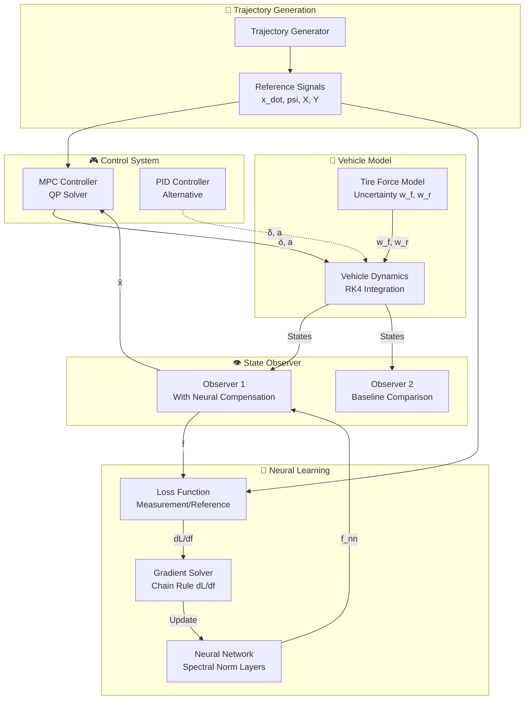
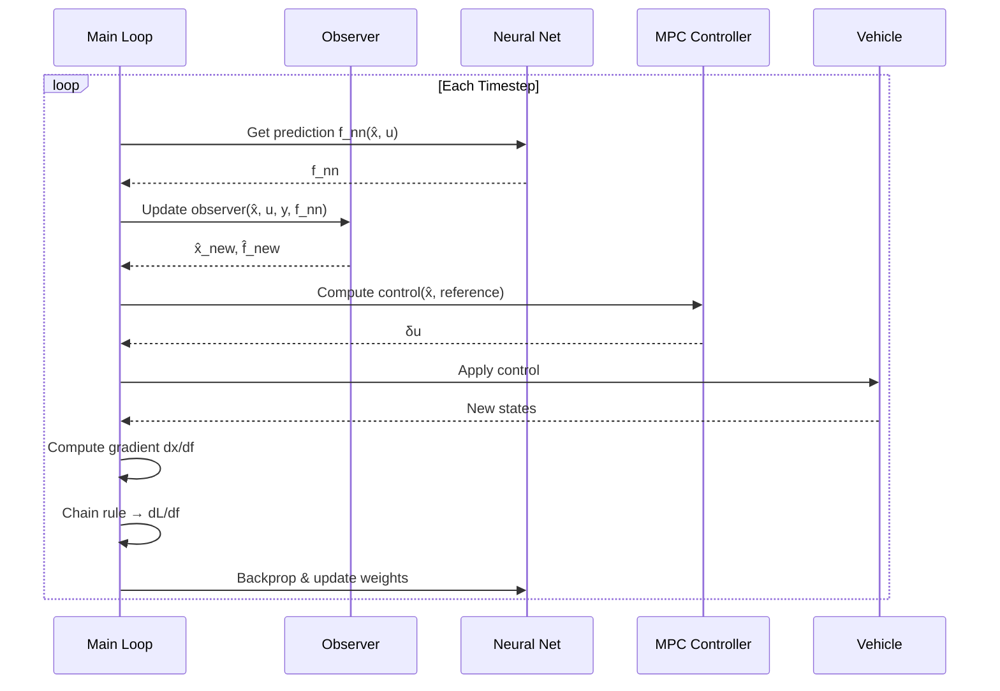
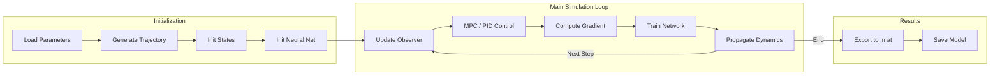

# Neural Network Enhanced MPC for Autonomous Vehicle Control

> A Model Predictive Control (MPC) framework enhanced with neural network-based learning for adaptive vehicle trajectory tracking.

---

## Introduction

This project implements an advanced control system that combines **Model Predictive Control (MPC)** with **Neural Network learning** to achieve robust trajectory tracking for autonomous vehicles. The system addresses model uncertainties—particularly tire force nonlinearities—by using a gradient-based learning approach to train a neural network that compensates for unknown dynamics.

The core innovation lies in the **observer-augmented learning framework**: a state observer estimates vehicle states while the neural network learns unmodeled disturbances, creating a synergistic system that improves both estimation and control performance over time.

### Problem Statement

Traditional MPC relies on accurate vehicle models, but real-world dynamics include:
- **Nonlinear tire forces** that vary with road conditions
- **Plant-model mismatch** from simplified vehicle models
- **Unknown disturbances** affecting vehicle motion

This framework addresses these challenges through online neural network adaptation.

---

## Key Features

| Feature | Description |
|---------|-------------|
| 🚗 **MPC Trajectory Tracking** | Horizon-based optimization for steering and acceleration control |
| 🧠 **Neural Network Learning** | Learns unknown tire forces and disturbances online |
| 👁️ **Dual Observer Design** | Two observers for state estimation with neural compensation |
| 📈 **Gradient-Based Training** | Sensitivity-based backpropagation through dynamics |
| 🔄 **Multiple Learning Modes** | Basic, continuous, and dictionary-based learning strategies |
| 📊 **MATLAB Export** | Saves results for analysis and visualization |

### Learning Modes

1. **Normal Basic** — Standard gradient descent updating
2. **Continuous Learning** — Model queue with weighted predictions  
3. **Learning by Dictionary** — Experience replay with feature storage

---

## Overall Architecture



### Component Interaction



---

## File Structure

### Core Files

| File | Purpose |
|------|---------|
| [`MAIN_MPC_car_general_test5_PID.py`](file:///c:/Users/Quang%20Huy%20Nugyen/Desktop/PHD_paper/Simulation/HUY_ALL_TEST/Neural/Huy_Neural/MAIN_MPC_car_general_test5_PID.py) | Main simulation script with training loop |
| [`gradient.py`](file:///c:/Users/Quang%20Huy%20Nugyen/Desktop/PHD_paper/Simulation/HUY_ALL_TEST/Neural/Huy_Neural/gradient.py) | Gradient solver for sensitivity analysis |
| [`NN_net.py`](file:///c:/Users/Quang%20Huy%20Nugyen/Desktop/PHD_paper/Simulation/HUY_ALL_TEST/Neural/Huy_Neural/NN_net.py) | Neural network architecture and training utilities |
| [`support_files_car_general.py`](file:///c:/Users/Quang%20Huy%20Nugyen/Desktop/PHD_paper/Simulation/HUY_ALL_TEST/Neural/Huy_Neural/support_files_car_general.py) | Vehicle model, MPC matrices, observers |
| [`support_files_car_simple.py`](file:///c:/Users/Quang%20Huy%20Nugyen/Desktop/PHD_paper/Simulation/HUY_ALL_TEST/Neural/Huy_Neural/support_files_car_simple.py) | Simplified lateral vehicle model |

### Module Details

#### `gradient.py` — Gradient Solver

Computes sensitivities for backpropagation through the observer dynamics.

```python
# Key Methods
GradientSolver_discret_general_w_D(sensitiveti)  # Discrete sensitivity update
ChainRule(ref, x_hat, dx_df, f_hat, f_nn, ...)   # Reference tracking loss
ChainRule3_test(measurement, x_hat, dx_df, ...)  # Measurement-based loss
```

**Gradient Propagation:**
```
dx/df[k+1] = (A + K·C) · dx/df[k] + D
```

---

#### `NN_net.py` — Neural Network

| Class | Description |
|-------|-------------|
| `Net` | 3-layer feedforward network with spectral normalization |
| `Learning_batch` | Fixed-size queue for experience replay |
| `ModelQueue` | Queue of models with exponential decay weighting |

**Network Architecture:**
- Input: 6 dimensions `[v_x, v_y, ψ, ψ̇, δ, a]`
- Hidden: 24 neurons × 2 layers (SiLU activation)
- Output: 2 dimensions `[f_nn_1, f_nn_2]` (tire force compensation)

---

#### `support_files_car_general.py` — Vehicle Dynamics

**Key Components:**
- **Trajectory Generator** — Three predefined trajectories
- **State-Space Model** — Discretized bicycle model
- **MPC Simplification** — Builds QP matrices (H, F, G)
- **Observer Design** — Luenberger observers with gain matrices
- **RK4 Integration** — Accurate state propagation

**State Vector (6 states):**
| Symbol | State |
|--------|-------|
| `x_dot` | Longitudinal velocity |
| `y_dot` | Lateral velocity |
| `psi` | Yaw angle |
| `psi_dot` | Yaw rate |
| `X` | Global X position |
| `Y` | Global Y position |

---

## Simulation Flow



---

## Configuration Parameters

### Neural Network

| Parameter | Default | Description |
|-----------|---------|-------------|
| `D_in` | 6 | Input dimension |
| `D_h` | 24 | Hidden layer size |
| `D_out` | 2 | Output dimension |
| `lr_nn` | 0.005 | Learning rate |
| `batch_size` | 3 | Gradient accumulation steps |

### Learning Weights

```python
# Loss weighting for state tracking
Weight_v_x = 10       # Longitudinal velocity
Weight_v_y = 20000    # Lateral velocity  
Weight_psi = 10       # Yaw angle
Weight_psi_dot = 20000  # Yaw rate
```

### Simulation

| Parameter | Value | Description |
|-----------|-------|-------------|
| `Ts` | 0.02s | Sample time |
| `hz` | Variable | Prediction horizon |
| `trajec_number` | 1-3 | Trajectory selection |

---

## Output Data

Simulation results are saved to `data_test1/test3_training_data_{epoch}.mat`:

| Variable | Shape | Description |
|----------|-------|-------------|
| `statesTotal` | (N, 6) | True vehicle states |
| `statesTotal_obs` | (N, 4) | Observer 1 estimates |
| `statesTotal_obs2` | (N, 4) | Observer 2 estimates |
| `f_nn_Save` | (2, N) | Neural network outputs |
| `f_uk_Save` | (2, N) | True tire forces |
| `UTotal` | (N, 2) | Control inputs [δ, a] |
| `dldf_Total` | (N, 2) | Gradient accumulation |

---

## Dependencies

```
numpy
matplotlib
torch
scipy
qpsolvers
casadi
filterpy
```

---

## Quick Start

```python
# Run the main simulation
python MAIN_MPC_car_general_test5_PID.py

# Key settings to modify:
Type_simulation = 'train'        # 'train' or 'evaluation'
Type_learning = 'learningby_Dict'  # Learning strategy
new_model = True                 # Start fresh or continue training
trajec_number = 3                # Trajectory (1, 2, or 3)
```

---

## License

Based on work by Mark Misin. Code can be freely used and distributed. Original copyright labels must be preserved.
