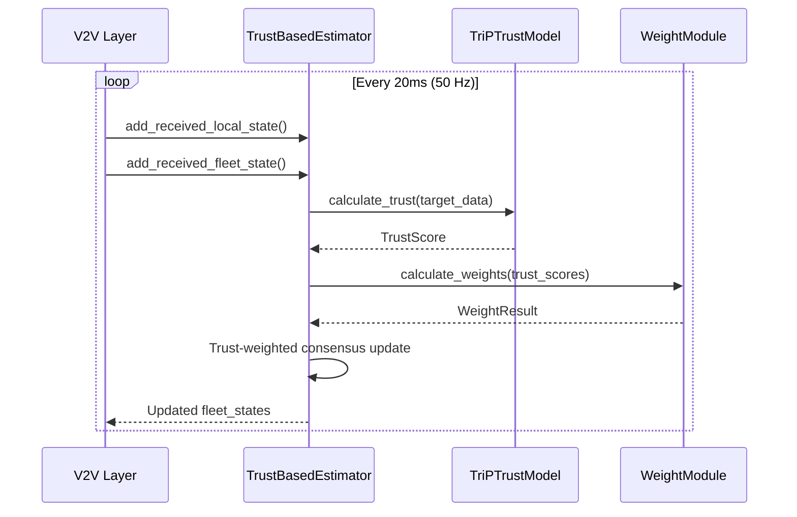

# 🛡️ Trust-Based Distributed Observer

> **A robust distributed state estimation framework with adaptive trust-based consensus for multi-vehicle coordination in adversarial environments**

[](https://python.org)
[](.)
[](.)

---

## 📋 Table of Contents

- [Introduction](#-introduction)
- [Key Features](#-key-features)
- [Architecture](#-architecture)
- [Components](#-components)
- [Quick Start](#-quick-start)
- [Configuration](#-configuration)
- [API Reference](#-api-reference)
- [Integration with Observer System](#-integration-with-observer-system)
- [Attack Detection](#-attack-detection)

---

## 🎯 Introduction

The **Trust-Based Distributed Observer** is a sophisticated state estimation module designed for cooperative vehicle platoons operating in potentially adversarial environments. It implements a multi-layered approach combining:

1. **TriP Trust Model** - Multi-component trust evaluation for each vehicle
2. **Adaptive Weight Calculation** - Trust-aware consensus weights with influence capping
3. **Distributed State Estimation** - Robust consensus-based fleet state estimation

This module integrates seamlessly with the new Observer system architecture (see [README_new_sys_observer.md](../README_new_sys_observer.md)).

### Research Context

This implementation supports research in:
- Attack-resilient vehicle platooning
- Trust management in vehicular networks
- Cooperative Adaptive Cruise Control (CACC)
- Distributed consensus algorithms

---

## ✨ Key Features

| Feature | Description |
|---------|-------------|
| **Multi-Component Trust** | Velocity, distance, acceleration, heading, and communication quality assessment |
| **Adaptive Weights** | Trust-proportional weight allocation with influence capping (max 40% per neighbor) |
| **Attack Detection** | Automatic flagging of suspicious behavior with mitigation |
| **Dirichlet Trust Levels** | 5-level trust rating with probabilistic updates |
| **EMA Smoothing** | Temporal stability for both trust scores and weights |
| **Pluggable Architecture** | Drop-in replacement for other fleet estimators |
| **Cross-Validation** | γ_cross from neighbor trust reports |

---

## 🏗️ Architecture

### Module Structure

```
TrustbasedDistributedObserver/
├── __init__.py                    # Package exports
├── trust_model.py                 # TriP Trust Model implementation
├── weight_trust_module.py         # Adaptive weight calculator
├── trust_based_fleet_estimator.py # Main fleet estimators
├── config_trust_estimator.yaml    # Configuration file
└── README.md                      # This documentation
```

### Component Diagram

```
┌─────────────────────────────────────────────────────────────────────────┐
│                    Trust-Based Distributed Observer                      │
├─────────────────────────────────────────────────────────────────────────┤
│                                                                          │
│  ┌─────────────────────┐    ┌─────────────────────┐                     │
│  │   TriP Trust Model  │───▶│  Weight Trust Module │                    │
│  │                     │    │                      │                     │
│  │  • Velocity Score   │    │  • w0 (direct)       │                    │
│  │  • Distance Score   │    │  • w_self (persist)  │                    │
│  │  • Accel Score      │    │  • w_N (neighbors)   │                    │
│  │  • Heading Score    │    │  • Influence Cap     │                    │
│  │  • Beacon Score     │    │  • EMA Smoothing     │                    │
│  │  • Quality Factor   │    │                      │                    │
│  └─────────────────────┘    └──────────┬──────────┘                     │
│            │                           │                                 │
│            │ trust_scores              │ weights                         │
│            ▼                           ▼                                 │
│  ┌──────────────────────────────────────────────────────────────────┐   │
│  │              Trust-Based Fleet Estimator                          │   │
│  │                                                                   │   │
│  │   x̂_new(T) = x̂_old(T)                                           │   │
│  │            + w0 × trust_T × (T_broadcast − x̂_old(T))            │   │
│  │            + Σ w_N × (Neighbor_N_estimate(T) − x̂_old(T))        │   │
│  │                                                                   │   │
│  │   Features:                                                       │   │
│  │   • Inherits from FleetStateEstimatorBase                        │   │
│  │   • Compatible with V2V communication layer                      │   │
│  │   • Auto-expansion for new vehicles                              │   │
│  └──────────────────────────────────────────────────────────────────┘   │
│                                                                          │
└─────────────────────────────────────────────────────────────────────────┘
```

### Data Flow



---

## 📦 Components

### 🛡️ TriP Trust Model (`trust_model.py`)

The TriP (Trust-based Intelligent Platoon) model evaluates vehicle trustworthiness using multiple independent metrics.

#### Trust Components

| Component | Formula | Weight |
|-----------|---------|--------|
| **Velocity** | $v_{score} = \max(1 - \frac{\|v - v_{ref}\|}{v_{ref}}, 0)^{12}$ | High |
| **Distance** | $d_{score} = \max(1 - \frac{\|d_{report} - d_{measure}\|}{d_{measure}}, 0)^{2}$ | Medium |
| **Acceleration** | $a_{score} = \max(1 - \|a / a_{max}\|, 0)^{0.3}$ | Low |
| **Heading** | $h_{score} = \max(1 - \frac{\theta_{diff}}{\theta_{max}}, 0)$ | Medium |
| **Quality** | $q = e^{-2 \cdot age} \cdot (1 - drop\_rate)$ | Applied |

#### Trust Levels

```
Level 1: Untrusted     (0.0 - 0.2)  🔴
Level 2: Suspicious    (0.2 - 0.4)  🟠
Level 3: Neutral       (0.4 - 0.6)  🟡
Level 4: Trusted       (0.6 - 0.8)  🟢
Level 5: Highly Trusted (0.8 - 1.0) 🔵
```

### ⚖️ Weight Trust Module (`weight_trust_module.py`)

Calculates adaptive consensus weights based on trust scores.

#### Weight Algorithm (v2)

```python
# Step 1: Fixed allocations
w0 = 0.3        # Direct measurement (target's broadcast)
w_self = 0.2    # Self (persistence)

# Step 2: Neighbor budget
budget = 1.0 - w0 - w_self  # = 0.5

# Step 3: Trust-proportional distribution
for neighbor in trusted_neighbors:
    w_raw = (trust[neighbor] / trust_sum) * budget
    w[neighbor] = min(w_raw, 0.4)  # Influence cap

# Step 4: EMA smoothing
weights = η * new_weights + (1-η) * prev_weights
```

### 🚗 Trust-Based Fleet Estimators

Two estimator variants:

1. **TrustBasedFleetEstimator** - Simple trust-weighted consensus
2. **TrustBasedKalmanEstimator** - Kalman prediction with trust-weighted measurement update

---

## 🚀 Quick Start

### Basic Usage

```python
from Observer.TrustbasedDistributedObserver import (
    TrustBasedFleetEstimator,
    create_trust_based_estimator
)

# Create estimator using factory
estimator = create_trust_based_estimator(
    estimator_type='trust_consensus',  # or 'trust_kalman'
    vehicle_id=0,
    fleet_size=3,
    state_dim=5,
    config={
        'trust': {'trust_threshold': 0.5},
        'weight': {'w0_fixed': 0.3, 'w_cap': 0.4}
    }
)

# In control loop
while running:
    # Add received states from V2V
    estimator.add_received_local_state(sender_id, state_dict, timestamp_ns)
    estimator.add_received_fleet_state(sender_id, fleet_dict, timestamp_ns)
    
    # Update fleet estimates
    fleet_states = estimator.update(
        local_state=my_state,
        dt=0.02,
        current_time_ns=int(time.time() * 1e9),
        control=np.array([steering, throttle])
    )
    
    # Access trust information
    trust_scores = estimator.get_all_trust_scores()
    attack_flags = estimator.get_attack_flags()
```

### Integration with VehicleObserver

```python
from Observer.VehicleObserverSimple import VehicleObserver

# Create observer with trust-based fleet estimation
observer = VehicleObserver(
    vehicle_id=0,
    config=config,
    logger=logger,
    local_estimator_type='ekf',
    fleet_estimator_type='trust_consensus'  # Use trust-based estimator
)

# V2V will automatically use the trust-based fleet estimator
```

---

## ⚙️ Configuration

### Configuration File (`config_trust_estimator.yaml`)

```yaml
fleet_estimator_type: trust_consensus

trust:
  weight_velocity: 12.0       # Velocity score sensitivity
  weight_distance: 2.0        # Distance score sensitivity
  trust_threshold: 0.5        # Minimum trust to be neighbor
  dirichlet_type: "Dual"      # Local + cross-validation
  ema_alpha: 0.3              # Trust smoothing

weight:
  w0_fixed: 0.3               # Direct measurement weight
  w_self_base: 0.2            # Self persistence weight
  w_cap: 0.4                  # Max neighbor influence (40%)
  kappa: 5                    # Max neighbors
  eta: 0.15                   # Weight smoothing

observer:
  observer_gain: 0.1          # Measurement correction
  consensus_gain: 0.2         # Consensus correction
  attack_mitigation: true     # Auto attack mitigation
```

### Scenario Presets

| Scenario | trust_threshold | w0_fixed | w_cap | attack_mitigation |
|----------|-----------------|----------|-------|-------------------|
| Cooperative | 0.3 | 0.4 | 0.5 | false |
| Standard | 0.5 | 0.3 | 0.4 | true |
| Adversarial | 0.7 | 0.2 | 0.3 | true |
| Sparse Comm | 0.5 | 0.2 | 0.4 | true |

---

## 📚 API Reference

### TrustBasedFleetEstimator

| Method | Description | Returns |
|--------|-------------|---------|
| `update(local_state, dt, time_ns, control)` | Main update cycle | `np.ndarray` |
| `get_trust_score(vehicle_id)` | Get detailed trust info | `TrustScore` |
| `get_all_trust_scores()` | Get all scores | `Dict[int, float]` |
| `get_trusted_vehicles(threshold)` | Get trusted IDs | `List[int]` |
| `is_vehicle_trusted(vehicle_id)` | Check if trusted | `bool` |
| `get_attack_flags()` | Get attack flags | `Dict[int, Dict]` |
| `get_current_weights()` | Get weight array | `np.ndarray` |
| `get_statistics()` | Get update stats | `Dict` |
| `add_neighbor_trust_report(...)` | Add cross-validation | `None` |

### TriPTrustModel

| Method | Description |
|--------|-------------|
| `calculate_trust(host_state, target_data, ...)` | Calculate trust score |
| `update_beacon_reception(target_id, received, time)` | Track beacons |
| `get_attack_flags()` | Get detection flags |
| `reset()` | Reset all trust data |

### WeightTrustModule

| Method | Description |
|--------|-------------|
| `calculate_weights(trust_scores)` | Calculate adaptive weights |
| `calculate_weights_for_target(...)` | Per-target weights |
| `update_fleet_size(new_size)` | Expand for new vehicles |

---

## 🔗 Integration with Observer System

This module is designed to be a **drop-in replacement** for other fleet estimators in the Observer system.

### Adding to FleetEstimatorFactory

```python
# In fleet_state_estimators.py, add to ESTIMATOR_TYPES:
from Observer.TrustbasedDistributedObserver import (
    TrustBasedFleetEstimator,
    TrustBasedKalmanEstimator
)

ESTIMATOR_TYPES = {
    'consensus': ConsensusFleetEstimator,
    'distributed_kalman': DistributedKalmanEstimator,
    'distributed_luenberger': DistributedLuenbergerEstimator,
    'trust_consensus': TrustBasedFleetEstimator,      # NEW
    'trust_kalman': TrustBasedKalmanEstimator,        # NEW
}
```

### In Vehicle Configuration

```yaml
# In fleet_config.yaml or config_vehicle_main.yaml
observer:
  fleet_estimator_type: trust_consensus
  
  # Trust-specific settings
  trust:
    trust_threshold: 0.5
    dirichlet_type: "Dual"
  weight:
    w0_fixed: 0.3
    w_cap: 0.4
```

---

## 🚨 Attack Detection

The system automatically detects and flags suspicious behavior:

### Attack Flags

| Flag | Condition | Interpretation |
|------|-----------|----------------|
| `flag_target_attack` | γ_local > 0.5 AND γ_cross < 0.5 | Target may be compromised |
| `flag_global_est_check` | γ_local < 0.5 AND γ_cross > 0.5 | Global estimate questionable |
| `flag_local_est_check` | local_trust < 0.5 | Local measurements unreliable |

### Automatic Mitigation

When `attack_mitigation: true`:
1. Flagged vehicles have trust reduced by 50%
2. Weights are recalculated with reduced influence
3. Events are logged for analysis

```python
# Check for attacks
flags = estimator.get_attack_flags()
for vehicle_id, vehicle_flags in flags.items():
    if vehicle_flags['target_attack']:
        print(f"Warning: Vehicle {vehicle_id} flagged for attack!")
```

---

## 📊 Performance

| Metric | Value |
|--------|-------|
| Update Rate | 50 Hz |
| Trust Calc Latency | < 1 ms |
| Weight Calc Latency | < 0.5 ms |
| Memory per Vehicle | ~2 KB |
| History Buffer | 50 samples |

---

## 🔬 References

- TriP Trust Model: Trust-based Intelligent Platoon framework
- Distributed Observer: Consensus-based state estimation
- Dirichlet Trust: Probabilistic trust level management

---

## 📝 Changelog

### v1.0.0 (2026-01)
- Initial release for new Observer system
- TriP Trust Model implementation
- Trust-weighted consensus estimator
- Trust-weighted Kalman estimator
- Attack detection and mitigation
- Configuration system

---

*Built for the QCar Multi-Vehicle Research Project*
