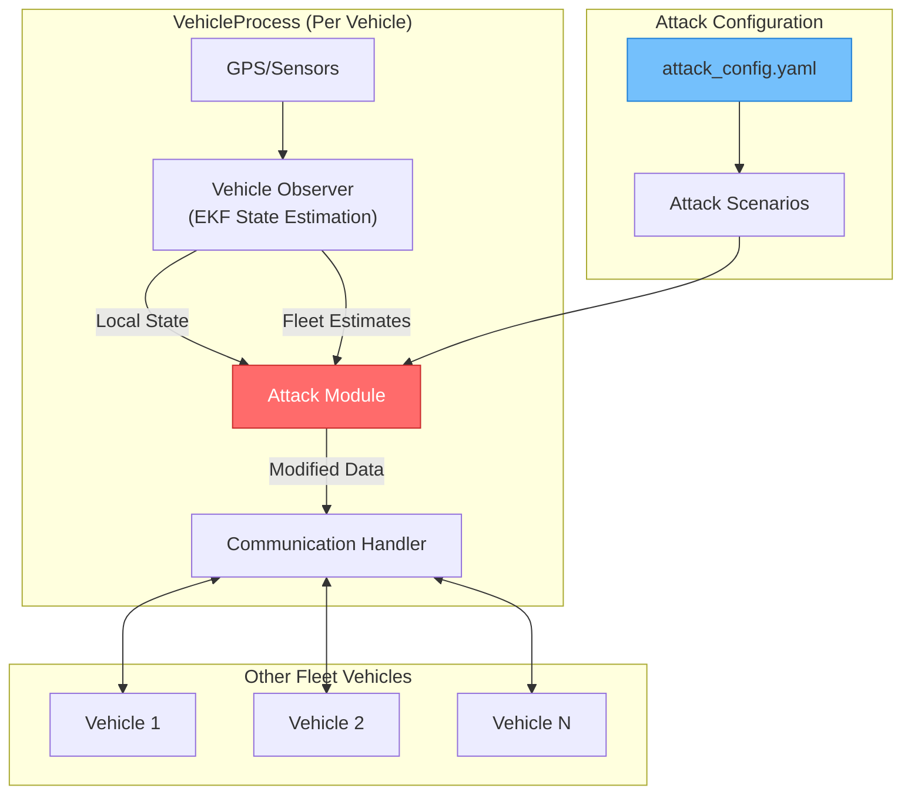
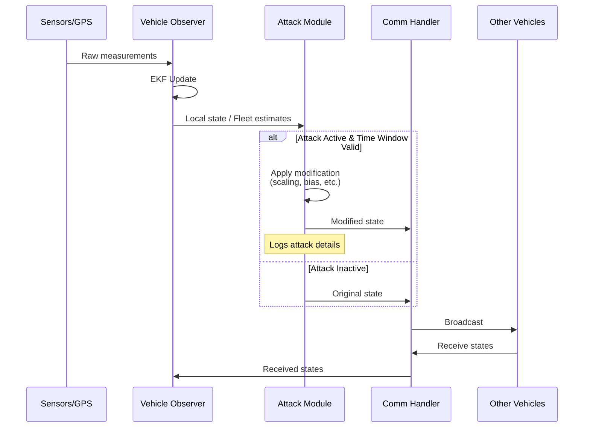
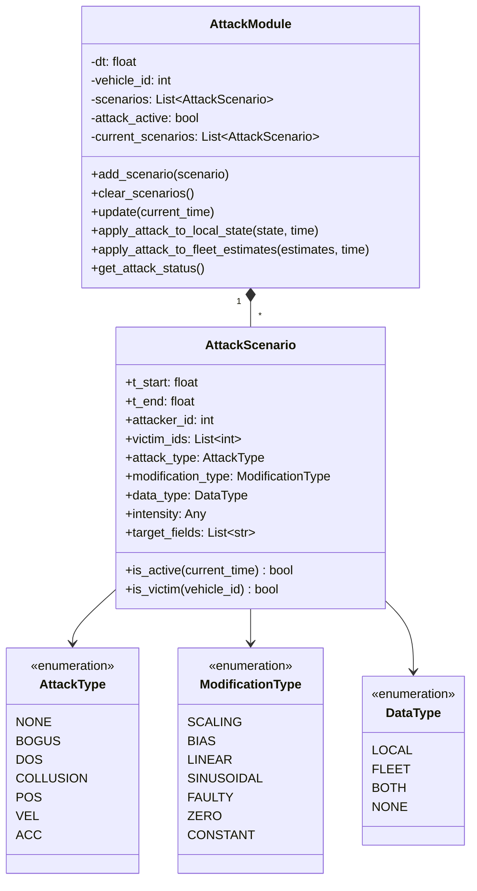
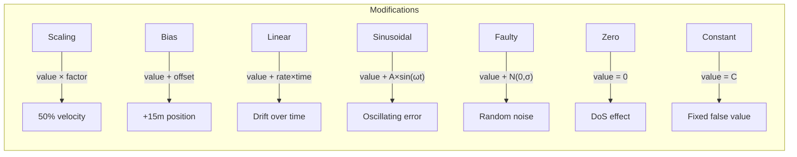
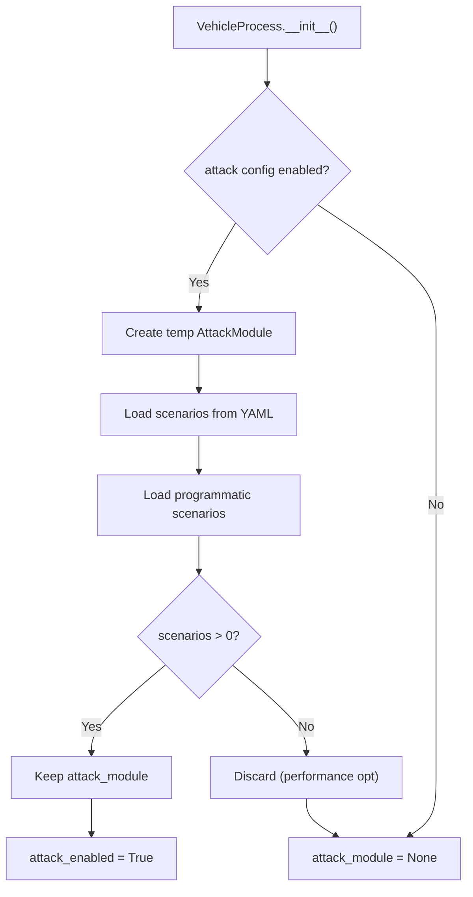

# Attack Module System

**Simulating Communication Attacks in Vehicle Fleet Networks**

---

## Table of Contents

1. [Introduction](#introduction)
2. [Key Features](#key-features)
3. [Overall Architecture](#overall-architecture)
4. [Module Components](#module-components)
5. [Attack Types and Modifications](#attack-types-and-modifications)
6. [Configuration Guide](#configuration-guide)
7. [Integration with VehicleProcess](#integration-with-vehicleprocess)
8. [Usage Examples](#usage-examples)

---

## Introduction

The **Attack Module System** is a sophisticated security testing framework designed for simulating communication attacks within autonomous vehicle fleet systems. Originally based on a MATLAB implementation (`Attack_module.m`), this Python module provides a comprehensive and extensible approach to evaluating the resilience of distributed vehicle observer systems against various adversarial scenarios.

The primary use case is **cybersecurity research** for Connected Autonomous Vehicles (CAVs), enabling researchers to:

- Test the robustness of trust evaluation mechanisms
- Evaluate the effectiveness of distributed observer consensus algorithms
- Validate attack detection and mitigation strategies
- Study the impact of malicious actors in V2V (Vehicle-to-Vehicle) communication

> [!NOTE]
> This module is designed for **research and testing purposes only**. It integrates seamlessly with the Fleet Framework's trust system, weight module, and distributed observer to provide a complete security evaluation environment.

---

## Key Features

| Feature | Description |
|---------|-------------|
| **Multiple Attack Types** | Supports Bogus, DoS, Position, Velocity, and Acceleration attacks |
| **7 Modification Types** | Scaling, Bias, Linear drift, Sinusoidal, Faulty (noise), Zero, Constant |
| **Time-Based Activation** | Precise attack scheduling with start/end timestamps |
| **Dual Data Targeting** | Attacks can target local broadcasts, fleet estimates, or both |
| **YAML Configuration** | Flexible scenario definition via configuration files |
| **Programmatic API** | Create and manage scenarios through Python code |
| **Performance Optimized** | Attack module only instantiated when scenarios exist |
| **Detailed Logging** | Comprehensive attack event logging for analysis |
| **MATLAB Compatibility** | Maintains compatibility with original MATLAB implementation |

---

## Overall Architecture

The Attack Module System follows a modular architecture that intercepts vehicle communication data before broadcasting. It operates as an intermediary layer between the vehicle's state estimation and network communication.



### Data Flow Architecture



---

## Module Components

The Attack Module System consists of three main components:

### 1. AttackModule.py - Core Attack Engine

The main attack processing module that handles:

- **Attack Scenario Management**: Add, remove, and track attack scenarios
- **Time-Based Activation**: Determine which attacks are active at any given time
- **State Modification**: Apply attack transformations to vehicle data
- **Statistics Tracking**: Monitor attack applications and effects



### 2. AttackScenarios.py - Scenario Factory

Provides convenient factory functions for creating attack scenarios:

| Function | Description |
|----------|-------------|
| `make_scenario()` | Generic scenario builder |
| `create_bogus_scenarios()` | 10 predefined bogus attack cases |
| `create_dos_scenarios()` | 3 denial-of-service variants |
| `create_position_attack()` | Position-specific attacks |
| `create_velocity_attack()` | Velocity-specific attacks |
| `create_acceleration_attack()` | Acceleration-specific attacks |
| `atk_scenarios()` | Main dispatcher matching MATLAB API |
| `load_scenarios_from_config()` | Load from YAML configuration |

### 3. attack_config.yaml - Configuration File

YAML-based configuration for defining attack scenarios without code changes:

```yaml
attack_settings:
  enabled: true
  dt: 0.01
  log_level: "WARNING"

scenarios:
  - name: "Bogus_Velocity_Scaling"
    enabled: true
    attack_type: "Bogus"
    modification_type: "scaling"
    data_type: "local"
    t_start: 10.0
    t_end: 15.0
    attacker_id: 1
    victim_ids: [-1]
    intensity: 0.5
    target_fields: ["velocity"]
```

---

## Attack Types and Modifications

### Attack Types

| Type | Description | Use Case |
|------|-------------|----------|
| **Bogus** | Sends falsified data | Testing trust evaluation |
| **DoS** | Denial of Service | Communication resilience |
| **POS** | Position-specific | GPS spoofing simulation |
| **VEL** | Velocity-specific | Speedometer tampering |
| **ACC** | Acceleration-specific | IMU manipulation |
| **Collusion** | Multiple attackers | Coordinated attack scenarios |

### Modification Types



### Target Fields

The attack module can target the following state fields:

- **X**: Position X coordinate (meters)
- **Y**: Position Y coordinate (meters)
- **theta**: Orientation/heading angle (radians)
- **velocity**: Linear velocity (m/s)
- **acceleration**: Linear acceleration (m/s²)

---

## Configuration Guide

### YAML Configuration Structure

```yaml
# Global settings
attack_settings:
  enabled: true          # Master switch
  dt: 0.01               # Simulation timestep
  log_level: "WARNING"   # Logging verbosity
  log_interval: 1.0      # Log throttle interval

# Scenario definitions
scenarios:
  - name: "Scenario_Name"
    enabled: true/false
    attack_type: "Bogus|DoS|POS|VEL|ACC"
    modification_type: "scaling|bias|linear|sinusoidal|faulty|zero|constant"
    data_type: "local|fleet|both"
    t_start: 10.0        # Attack start time (seconds)
    t_end: 15.0          # Attack end time (seconds)
    attacker_id: 1       # Vehicle performing the attack
    victim_ids: [-1]     # Targets (-1 = all vehicles)
    intensity: 0.5       # Modification parameter
    target_fields: ["velocity", "X", "Y"]
    description: "Human-readable description"
```

### Sinusoidal Parameters

For sinusoidal modifications, use a dictionary for intensity:

```yaml
intensity:
  amplitude: 5.0    # Oscillation amplitude
  frequency: 0.5    # Frequency in Hz
  phase: 0.0        # Phase offset in radians
```

---

## Integration with VehicleProcess

### Initialization Flow



### Runtime Attack Application

The attack module is invoked in two key locations:

1. **`broadcast_own_state()`** - For local state broadcasts
2. **`broadcast_fleet_estimates()`** - For distributed observer estimates

```python
# From VehicleProcess.py - Local State Attack
if self.attack_module is not None:
    elapsed_time = time.time() - self.comm_start_time
    self.attack_module.update(elapsed_time)
    
    if self.should_attack_local_data():
        state_array = np.array([pos_x, pos_y, theta, velocity])
        attacked_state = self.attack_module.apply_attack_to_local_state(
            state_array, elapsed_time
        )
        # Update broadcast with attacked values
```

### Helper Methods in VehicleProcess

| Method | Purpose |
|--------|---------|
| `should_attack_local_data()` | Check if local data should be attacked |
| `should_attack_fleet_data()` | Check if fleet data should be attacked |

---

## Usage Examples

### Example 1: Programmatic Scenario Creation

```python
from AttackModule import AttackModule
from AttackScenarios import atk_scenarios

# Create attack module
attack_module = AttackModule(dt=0.01, vehicle_id=1)

# Add Bogus case 2 (velocity scaling by 0.5)
atk_scenarios(
    attack_module,
    attack_type="Bogus",
    data_type="local",
    case_number=2,
    t_star=10.0,
    t_end=15.0,
    attacker_id=1,
    victim_id=-1
)

print(f"Configured {len(attack_module.scenarios)} scenario(s)")
```

### Example 2: Load from Configuration

```python
from AttackModule import AttackModule
from AttackScenarios import load_scenarios_from_config

# Create and configure from YAML
attack_module = AttackModule(dt=0.01, vehicle_id=1)
load_scenarios_from_config(
    attack_module,
    config_path="attack_config.yaml",
    enabled_only=True  # Only load enabled scenarios
)
```

### Example 3: Custom Scenario

```python
from AttackModule import AttackScenario, AttackType, ModificationType, DataType

# Create custom sinusoidal attack
scenario = AttackScenario(
    t_start=5.0,
    t_end=20.0,
    attacker_id=2,
    victim_ids=[0, 1],
    attack_type=AttackType.BOGUS,
    modification_type=ModificationType.SINUSOIDAL,
    data_type=DataType.BOTH,
    intensity={'amplitude': 3.0, 'frequency': 1.0, 'phase': 0.0},
    target_fields=['X', 'Y'],
    scenario_name="Custom_Sinusoidal_Attack",
    description="Oscillating position error on X and Y"
)

attack_module.add_scenario(scenario)
```

### Example 4: Runtime Attack Status

```python
# Get attack status during simulation
status = attack_module.get_attack_status()
print(f"Attack Active: {status['attack_active']}")
print(f"Active Scenarios: {status['active_scenarios']}")
print(f"Total Applied: {status['total_attacks_applied']}")
print(f"Current Scenarios: {status['current_scenario_names']}")
```

---

## Logging and Debugging

Attack events are logged to dedicated log files:

```
logs/attack_vehicle_0.log
logs/attack_vehicle_1.log
logs/attack_vehicle_2.log
...
```

### Log Format Examples

```
[WARNING] ======================================================================
[WARNING] 🔴🔴🔴 LOCAL STATE ATTACK ACTIVE V1 at elapsed=10.25s 🔴🔴🔴
[WARNING] ======================================================================
[WARNING] 📍 Position X:   5.2340 →   5.2340 m (Δ +0.0000)
[WARNING] 📍 Position Y:   3.1250 →   3.1250 m (Δ +0.0000)
[WARNING] 🏎️  Velocity:    2.5000 →   1.2500 m/s (Δ -1.2500)
[WARNING] ======================================================================
```

---

## Related Documentation

- [Trust System Documentation](../Trust/README.md)
- [Weight Module Documentation](../Weight/README.md)
- [Observer System Documentation](../Observer/README.md)
- [Fleet Framework Overview](../../README.md)

---

> [!IMPORTANT]
> Always ensure that the attack module is disabled (`enabled: false`) in production environments. This module is intended for controlled testing and research scenarios only.

---

*Last Updated: January 2026*
