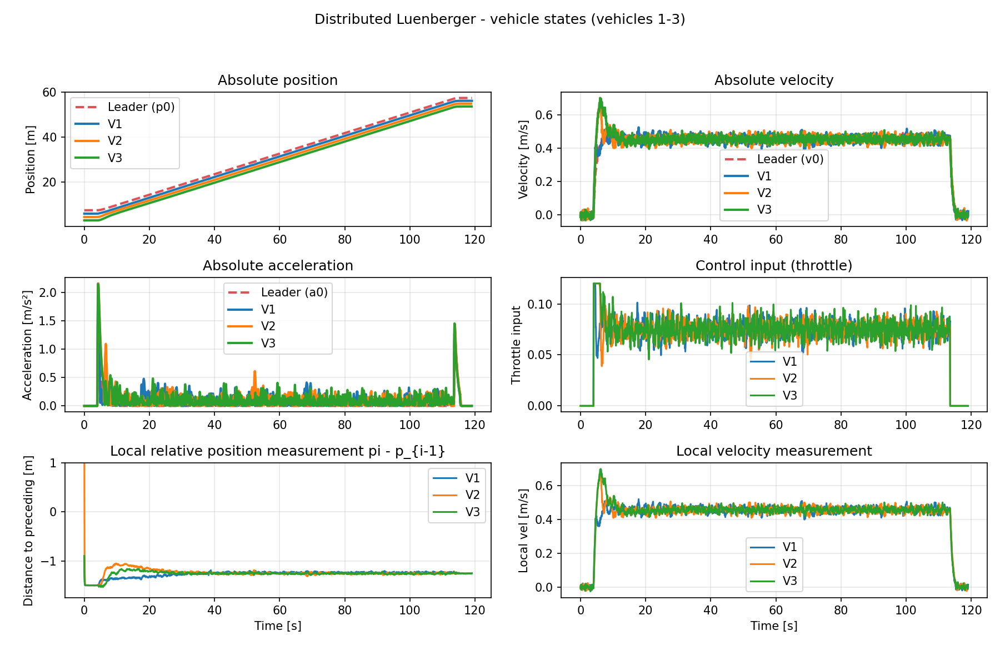
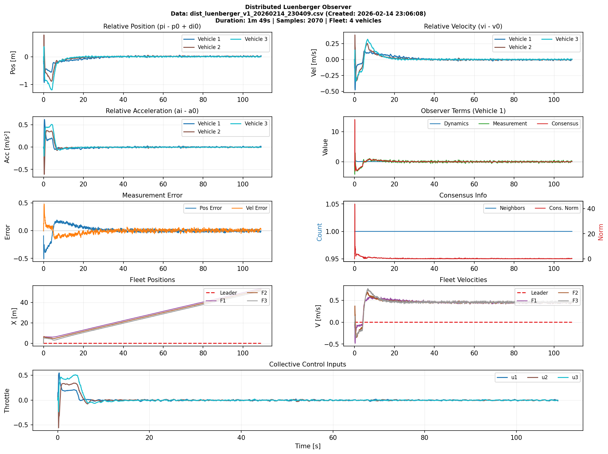
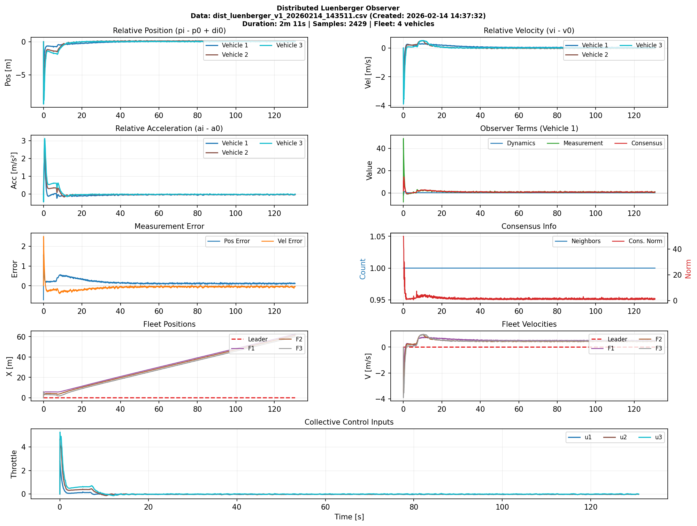
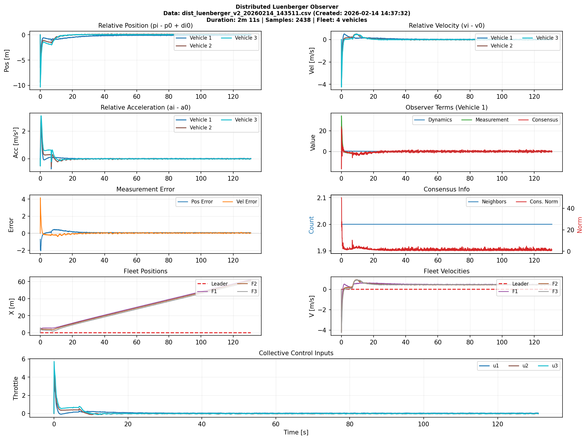
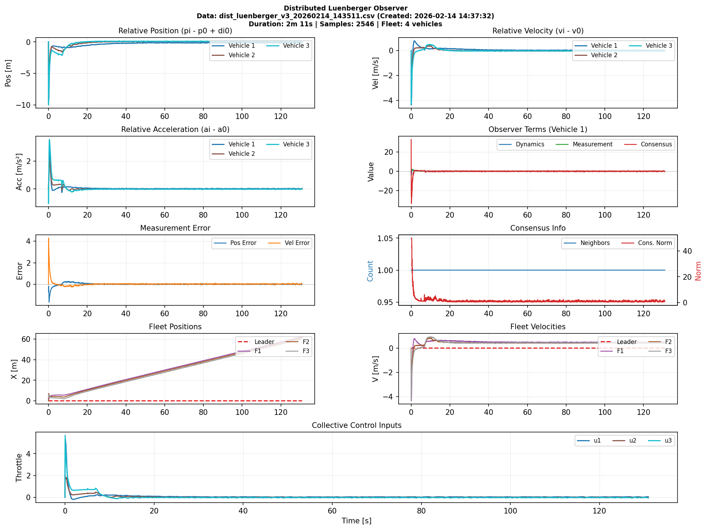
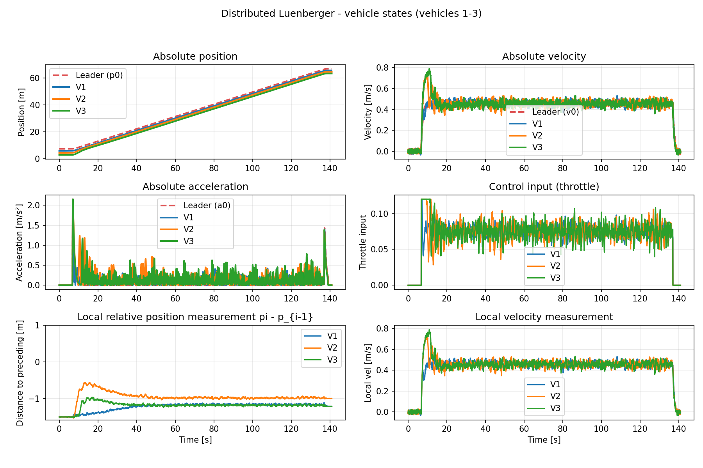

# Update Log 2026/04/07 (Shengya MENG)

**Commit Message**: Plot all observer states real-time in the GUI

## Completed Tasks / 已完成任务:

- [x] **Enhanced real-time observer state visualization in GUI** / **完善GUI中实时观测器状态绘制功能**
  - Implemented new plotting window displaying each vehicle's observer states (position, velocity, acceleration) over time / 实现新的绘图窗口，展示每个车辆的观测器状态（位置、速度、加速度）随时间变化
  - Uses distinct colors for different vehicles and adds legend & grid lines for improved readability / 使用不同颜色区分车辆状态，添加图例和网格线提升可读性
  - Implementation: [plot_all_observer_viewer.py](plot_all_observer_viewer.py)

- [x] **Added lateral controller to maintain vehicle y-position** / **添加横向控制器保持车辆y方向位置**
  - Controller maintains vehicles at y=-0.62 to keep fleet centered on road / 控制器通过调整转向角保持车辆在y=-0.62位置，确保车队在道路中心
  - Implementation: [stanley_y_hold_controller.py](Development/multi_vehicle_self_driving_RealQcar/qcar/Controller/ShengyaCtr/stanley_y_hold_controller.py)
  - Configuration: Set `lateral_controller_type: 'stanley_y_hold'` in [config_controller_sim.yaml](Development/multi_vehicle_self_driving_RealQcar/qcar/Controller/config_controller_sim.yaml)
  - Note: Use conservative tuning parameters to avoid aggressive control / 参数调整应保守，避免过于激进的控制


# Update Log 2026/02/17 (Shengya MENG)

Commit Message: Add wave road.
 
 # Update Log 2026/02/17 (Shengya MENG)


Commit Message: Improve feedforward mapping, add classic distributed controller, enhance leader PID, prepare for Hinf/road tests
完善前馈映射，补充分布式控制器，改进领导车PID，准备Hinf与路面测试

## Completed Tasks / 已完成任务:

- [x] 领导者的耿跟踪速度可以在 config 文件中提前预设  
  Leader's reference speed can be preset in config file  
  相关配置: [controller_config.yaml](Development/fleet_framwork/controller_config.yaml)

- [x] 更加准确的前馈，速度到专油门的映射  
  Improved feedforward: more accurate speed-to-throttle mapping  
  相关脚本: [get_throttle_2_velocity.py](Development/multi_vehicle_self_driving_RealQcar/qcar/DataAnalysis/get_throttle_2_velocity.py)

- [x] 补充了经典的分布式控制器类  
  Added classic distributed controller class  
  相关实现: [classical_distributed_control.py](J:\Qcar_Development\QCar2_Cran\Development\multi_vehicle_self_driving_RealQcar\qcar\Controller\ShengyaCtr\classical_distributed_control.py)

- [x] 在领导者的纵向PID控制中考虑了速度扰动（不再使用）  
  Considered speed disturbance in leader's longitudinal PID (now deprecated)  
  相关实现: [longitudinal_controllers.py](J:\Qcar_Development\QCar2_Cran\Development\multi_vehicle_self_driving_RealQcar\qcar\Controller\longitudinal_controllers.py)

## Pending Tasks / 待完成任务:

- [ ] 设置坡度与波浪路面，测试 Hinf 性能  
  Set slope/wavy road, test Hinf performance

- [ ] 设置减速带，测试控制器性能  
  Add speed bumps, test controller performance

# Update Log 2026/02/14 Shengya MENG)
Commit Message: Broadcast observer state via V2V, fix feedforward-induced steady-state error

## Completed Tasks / 已完成任务:

- [x] **Added observer state in V2V communication / V2V通信中添加观测器状态广播**
  - Each vehicle broadcasts estimated state to followers via V2V / 每个车辆通过V2V向跟随车广播估计状态


  - Modified [distributed_luenberger_estimator.py](Development/multi_vehicle_self_driving_RealQcar/qcar/Observer/ShengyaObs/distributed_luenberger_estimator.py) and [v2v_manager.py](Development/multi_vehicle_self_driving_RealQcar/qcar/V2V/v2v_manager.py)

- [x] **Fixed steady-state error caused by excessive feedforward / 修复前馈过大导致的静态误差**
  - Root cause: feedforward throttle too high / 原因：前馈油门值过大
  - Adjusted in [state_feedback_controller.py](Development/multi_vehicle_self_driving_RealQcar/qcar/Controller/ShengyaCtr/state_feedback_controller.py)

## Current Performance / 当前性能:

Controller results / 控制器结果:


Observer results / 观测器结果:


# Update Log 2026/02/14 (Shengya MENG)

Commit Message: Remove feedforward from V2V collective control, add throttle-velocity mapping, update gains

## Completed Tasks / 已完成任务:

- [x] **Removed feedforward throttle from V2V control input / 移除V2V通信中的前馈控制信号**

- [x] **Added throttle-velocity mapping estimation / 添加油门-速度映射估计**
  - New controller: [throttle_sequence_controller.py](Development/multi_vehicle_self_driving_RealQcar/qcar/Controller/ShengyaCtr/throttle_sequence_controller.py)
  - Analysis script: [get_throttle_2_velocity.py](Development/multi_vehicle_self_driving_RealQcar/qcar/DataAnalysis/get_throttle_2_velocity.py)

- [x] **Updated observer/controller gains / 更新观测器和控制器增益**
  - Controller and observer solved separately / 控制器和观测器分开求解
  - No convergence rate constraint / 无收敛速度约束

- [x] **Verified system performance / 验证系统性能**
  - 
  - 
  - 
  - 
  - Fleet is stable but vehicle 2 follows too closely due to observer steady-state error / 车队稳定但车辆2跟车距离偏小，原因是观测器存在静差。 暂不清楚原因。但测试发现于于滤波器，估计的控制输入无关。

## Pending Tasks / 待完成任务:

- [ ] **Diagnose observer steady-state error / 诊断观测器静差原因**

# Update Log (2026/02/12) (Shengya MENG)

Commit Message: Optimized the code structure of the distributed observer, observer converges to zero

## Completed Tasks / 已完成任务:

- [x] **Optimized code structure of distributed observer / 优化分布式观测器的代码结构** 
  - Modified [distributed_luenberger_estimator.py](Development/multi_vehicle_self_driving_RealQcar/qcar/Observer/ShengyaObs/distributed_luenberger_estimator.py): refactored main observer update logic into multiple functions for better readability and maintainability / 将主要分布式观测器更新逻辑拆分成多个函数，提升代码可读性和维护性
  - `_get_leader_state_with_fallback`
  - `_compute_dynamics_term`
  - `_compute_measurement_term`
  - `_calculate_estimated_collective_control`
  - `_calculate_collective_cov`
  - `_compute_consensus_term`
  - Removed state transformation at each observer update entry, now using `estimated_state.copy()` directly to reduce conversion errors / 移除每次进入分布式观测器更新逻辑的转换，改为直接通过estimated_state.copy()减少转换带来的误差

- [x] **Removed feedforward term from collective control input / 在分布式观测器中从集体控制输入中减去前馈项**
  - Modified collective control calculation in [distributed_luenberger_estimator.py](Development/multi_vehicle_self_driving_RealQcar/qcar/Observer/ShengyaObs/distributed_luenberger_estimator.py): subtract feedforward term to ensure observer convergence / 在计算集体控制输入时减去前馈项以确保观测器估计能够正确收敛到真实状态

- [x] **Added custom camera follow feature / 添加自定义相机功能**
  - Camera maintains constant relative distance with leader vehicle / 该相机能够和头车保持恒定的相对距离
  - Performance unsatisfactory due to stuttering, feature debugging postponed / 效果不理想，相机运动十分卡顿，暂时放弃该功能调试

- [x] **Normalized plot time axis to start from zero / 将绘图时间轴强制从0开始**
  - Modified [plot_distributed_luenberger.py](Development/multi_vehicle_self_driving_RealQcar/qcar/Observer/ShengyaObs/plot_distributed_luenberger.py): normalized time axis for easier comparison between different recording files / 修改时间处理逻辑，便于不同记录文件之间的对比分析
  - 
  

## Pending Tasks / 待完成任务:

- [ ] **Test observer performance with estimated collective control input / 测试使用估计集体控制输入的观测器性能**
  - Currently using V2V collective control input (read control signal by V2V communication) for stability / 目前使用V2V集体控制输入（通过V2V通信读取控制信号）来确保系统稳定
  - Need to test with observer's self-calculated collective control input to validate design correctness / 后续需要测试使用观测器自己计算的集体控制输入的性能，验证观测器设计的正确性

- [ ] **Test state feedback controller with distributed observer estimates / 测试基于分布式观测器的状态反馈控制器性能**
  - Controller file: [state_feedback_controller.py](Development/multi_vehicle_self_driving_RealQcar/qcar/Controller/ShengyaCtr/state_feedback_controller.py)
  - Currently using true state feedback for guaranteed performance / 目前状态反馈控制器使用真实状态反馈来确保性能
  - Need to switch to observer estimated states as feedback input to test closed-loop system performance / 后续需要切换到使用分布式观测器的估计状态作为反馈输入，测试整个系统的闭环性能


# Update Log (2026/02/11) (Shengya MENG)

Commit Message: Fixed large distance between vehicle 1 and vehicle 0

## Completed Tasks / 已完成任务:

- [x] **Fixed large distance between vehicle 1 and vehicle 0 / 修复车辆1与车辆0之间距离过大问题**
  - Analysis files: [analysis_steady_state_gap_error.md](Development/multi_vehicle_self_driving_RealQcar/qcar/Controller/ShengyaCtr/analysis_steady_state_gap_error.md)


- [x] **Created test controller using true state feedback / 创建使用真实状态反馈的测试控制器**
  - Controller implementation: [state_feedback_controller_no_observer.py](Development/multi_vehicle_self_driving_RealQcar/qcar/Controller/ShengyaCtr/state_feedback_controller_no_observer.py)
  - Verified that controller performs well with true state feedback
  
- [x] **Analyzed tau parameter / 分析tau参数结果**
  - Result: τ ≈ 0.16
  - Analysis scripts: [diagnose_tau_data.py](diagnose_tau_data.py)

## Pending Tasks / 待完成任务:

- [ ] **Diagnose and eliminate steady-state error in observer / 分析观测器稳态误差的原因并尝试消除**
  - **Context / 背景**: Even in ideal conditions (controller uses true state feedback, control signals in observer obtained directly via V2V), observer estimation error still exhibits steady-state bias
  - **Possible causes / 可能原因**:
    - Observer gain insufficient to eliminate error / 观测器增益不够高，无法完全消除误差
    - Unmodeled dynamics or external disturbances / 系统存在未建模动态或外部扰动
    - Discretization effects / 离散化导致的误差
  - **Validation approach / 验证方法**: Test distributed observer in MATLAB simulation to isolate root cause
  

# Update Log (2026/02/06) (Shengya)

Commit Message: Using fake observer to test the controller

## Completed Tasks:

- [x] **Added fake observer for testing state feedback controller** - Created a simple fake observer that outputs the true state with optional noise for testing purposes
  - Implemented in [distributed_luenberger_estimator.py](Development/multi_vehicle_self_driving_RealQcar/qcar/Observer/ShengyaObs/distributed_luenberger_estimator.py) as `_fake_estimated_state_for_debugging()`
  - Can be toggled on/off for testing vs real observer performance

- [x] **Added the low pass filter on the distance and velocity measurement in the observer**
  - Implemented in [distributed_luenberger_estimator.py](Development/multi_vehicle_self_driving_RealQcar/qcar/Observer/ShengyaObs/distributed_luenberger_estimator.py) as `_sensor_filter(s()`
  - Helps smooth out noisy measurements and improve observer stability

## Pending Tasks:

- [ ] **Analyze controller performance with fake observer** 
  - fix the problem of the distance between leader and vehicle 1 is large.
  - The convergence time should be shorter.

- [ ] **Add the filter of the control input in the observer**
  - Implement a low-pass filter on the control input used in the observer prediction to reduce noise impact


# Update Log (2026/02/05) (Shengya)

Commit Message: fix observer state recording and plotting scripts

## Completed Tasks / 已完成任务:

- [x] **Add script to plot observer estimation error and calculate convergence time / 添加绘制观测器估计误差脚本并计算收敛时间**
  - Script: [plot_observer_estimation_error.py](Development/multi_vehicle_self_driving_RealQcar/qcar/Observer/ShengyaObs/plot_observer_estimation_error.py)
  - Generates subplots of estimation errors for each vehicle / 为每个车辆生成估计误差的子图
  - Calculates convergence time and steady-state RMS error / 计算收敛时间和稳态RMS误差

- [x] **Fix true state recording in observer recorder / 修正观测器记录器中的真实状态记录** - Now records all true position, velocity, and acceleration for all vehicles with synchronized data / 现在记录所有车辆的真实位置、速度和加速度, 保持数据同步
  - Modified [distributed_luenberger_recorder.py](Development/multi_vehicle_self_driving_RealQcar/qcar/Observer/ShengyaObs/distributed_luenberger_recorder.py) methods `_create_log_row()` and `_initialize_log_file()` / 修改了 `_create_log_row()` 和 `_initialize_log_file()` 方法


## Pending Tasks / 待完成任务:

- [ ] **Analyze observer estimation error / 分析观测器估计误差** - Use new plotting script to analyze estimation error for each vehicle / 使用新的绘图脚本分析各车辆的估计误差
  - Run script: `python plot_observer_estimation_error.py -i <recording_file.csv>`
  - Check convergence time and steady-state RMS error for position, velocity, acceleration estimation error of each vehicle / 检查各车辆位置、速度、加速度估计误差的收敛时间和稳态RMS误差
  - Diagnose observer performance issues based on error characteristics / 根据误差表现诊断观测器性能问题

## The Performance Now / 当前性能:


**Analysis / 分析:**
All errors converge rapidly, but the position estimation error exceeds 0.4m, indicating a large deviation between true inter-vehicle spacing error and estimated spacing error, which causes poor controller performance in regulating inter-vehicle distance. / 所有的误差能够快速收敛, 但是有关位置估计误差超过0.4. 这意味着估计的真实间距误差与估计间距误差之间的偏差较大.从而导致控制器无法很好地控制车辆间距. 


# Update Log (2026/02/03) (Shengya)

Commit Message: export gains to YAML, improve observer prediction, add state plots

## Completed Tasks:

- [x] **Observer/controller gains exported to YAML** / **观测器/控制器增益导出为YAML配置**
  - MATLAB exporter: [save_gain2python.m](Ctr_Obs_gain_from_Matlab/save_gain2python.m)
  - Generated example: [car1.yaml](Ctr_Obs_gain_from_Matlab/gain_for_python_20260203_160335/car1.yaml), [car2.yaml](Ctr_Obs_gain_from_Matlab/gain_for_python_20260203_160335/car2.yaml), [car3.yaml](Ctr_Obs_gain_from_Matlab/gain_for_python_20260203_160335/car3.yaml)
  - Runtime configs: [car1.yaml](Development/multi_vehicle_self_driving_RealQcar/qcar/Observer/extra_configs/car1.yaml), [car2.yaml](Development/multi_vehicle_self_driving_RealQcar/qcar/Observer/extra_configs/car2.yaml), [car3.yaml](Development/multi_vehicle_self_driving_RealQcar/qcar/Observer/extra_configs/car3.yaml)

- [x] **Auto-select QCar2 in spawner** / **车辆生成脚本自动选择QCar2**
  - Implementation: [initCars_new.py](Development/QCar2_multi-vehicle_control/initCars_new.py#L606)

- [x] **Use control input in observer prediction** / **观测器状态预测中使用control input**
  - Cached in update and reused in prediction: [VehicleObserverSimple.py](Development/multi_vehicle_self_driving_RealQcar/qcar/Observer/VehicleObserverSimple.py#L426-L579)

- [x] **Plot true/local vehicle states from recordings** / **从记录文件绘制车辆真实/本地状态**
  - Script: [plot_distributed_luenberger_vehicle_state.py](Development/multi_vehicle_self_driving_RealQcar/qcar/Observer/ShengyaObs/plot_distributed_luenberger_vehicle_state.py)
  - Data: [observer_recordings](observer_recordings/)


## Pending Tasks:

- [ ] **Diagnose drift in observer estimate** / **分析观测器估计值漂移原因**
  - Compare $p_i - p_0 + d_{i0}$: true vs estimated, decide whether drift comes from controller or observer.
  - Use recordings and plotting entry: [observer_recordings](observer_recordings/) + [plot_distributed_luenberger_vehicle_state.py](Development/multi_vehicle_self_driving_RealQcar/qcar/Observer/ShengyaObs/plot_distributed_luenberger_vehicle_state.py)


# Update Log (2026/02/02) (Shengya)

Commit Message: integrated V2V control signals in fleet estimator

## Completed Tasks:

- [x] **V2V control signal integration** / **V2V通信控制信号集成**
  - Implemented V2V control signal retrieval in [distributed_luenberger_estimator.py](Development/multi_vehicle_self_driving_RealQcar/qcar/Observer/ShengyaObs/distributed_luenberger_estimator.py#L765)
  - Using `g=3` gain factor: `collective_control[i] = g * throttle` converts throttle to control input u. **Maybe it is wrong**

- [x] **Removed redundant state transformations** / **移除冗余状态转换**
  - Cleaned up unnecessary conversions in fleet_state_estimator

- [x] **Disabled excessive smoothing filters** / **禁用过度平滑滤波**
  - Commented out unnecessary exponential smoothing in controller

## Pending Tasks:

- [ ] **Refactor gain configuration system in MTALAB** / **MATLAB重构增益配置系统**
  - Rewrite all_gains.txt generation script
  - Backup LMI constraints and parameters
  - Align structure with existing config files

- [ ] **Validate observer in MATLAB simulation** / **MATLAB仿真验证观测器**
  - Implement vehicle longitudinal dynamics with fixed lateral control
  - Simulate distributed observer using real QCar data
  - Verify observer gains are correctly tuned
  - Data organization: ✅ Observer dynamics implemented

# Update Log (2026/01/30) (Shengya)

Commit Message: validate control performance

## Completed Tasks:

- [x] **Simplified logging in distributed Luenberger observer** - Removed verbose info/warning logs to reduce noise
  - Removed adjacency matrix shape mismatch warnings
  - Removed fleet_states shape correction warnings
  - Removed K matrix not found warnings
  - Removed extra config file not found warnings
  - Removed leader/previous vehicle state warnings
  - Removed consensus term excessive warnings
  - Kept critical error logs for dimension mismatches
  - Modified [distributed_luenberger_estimator.py](Development/multi_vehicle_self_driving_RealQcar/qcar/Observer/ShengyaObs/distributed_luenberger_estimator.py)

- [x] **Fixed collective control input calculation in observer** - Changed to use actual throttle values
  - Changed from complex K-matrix based calculation: `collective_control[vehicle_id - 1] = (Ki0 @ (Fi @ x_vec))[0] + ...`
  - To simple throttle replication: `collective_control = np.full(self.observer_size, control[1])`
  - Each follower vehicle now uses the same throttle value (control[1]) as control input
  - Modified [distributed_luenberger_estimator.py](Development/multi_vehicle_self_driving_RealQcar/qcar/Observer/ShengyaObs/distributed_luenberger_estimator.py) Line 745


- [x] **State feedback controller is working well** - Performance is actually good despite initial concerns
  - StateFeedbackController + DistributedLuenbergerEstimator combination proven effective
  - Observer estimation quality is high (evidenced by minimal velocity tracking error)
  - Control law successfully push the distace to be desired.
  - But, **the distance between leader and vehicle 1, is still large.**

- [x] **Estimated control input computation implemented** - Control input estimation in observer completed but currently using own controller input for better performance
  - Control input estimation logic exists in observer (commented K-matrix calculation)
  - Currently using simplified approach: `collective_control = np.full(self.observer_size, control[1])`
  - This approach works well and maintains system stability

- [x] **Parameter tuning completed** - Adjusted gains to achieve d=0.8m and h=0.3s
  - Modified spacing parameter `self.d = 0.8` in observer
  - Modified time headway `self.h = 0.3` in observer
  - Experimental results show average spacing: 1.51m (includes both d and velocity-dependent term)


# Update Log 2026/01/29 (Shengya)

Commit Message: Implement per-vehicle controller configuration system with distributed observer integration and enhanced testing

## Completed Tasks

- [x] **Per-vehicle controller configuration system implemented** - Each vehicle can now have independent controller types and parameters through [per_vehicle_controllers](Development/multi_vehicle_self_driving_RealQcar/qcar/Controller/config_controller_sim.yaml) section in [config_controller_sim.yaml](Development/multi_vehicle_self_driving_RealQcar/qcar/Controller/config_controller_sim.yaml)
  - Modified [config_controller_loader.py](Development/multi_vehicle_self_driving_RealQcar/qcar/Controller/config_controller_loader.py) to support per-vehicle configuration with fallback to global defaults
  - Updated [controller_manager.py](Development/multi_vehicle_self_driving_RealQcar/qcar/Controller/controller_manager.py) to pass vehicle_id for configuration loading
  - Created [test_config.py](Development/multi_vehicle_self_driving_RealQcar/qcar/Controller/test_config.py) for comprehensive testing (bilingual output)
  - Added [PER_VEHICLE_CONFIG_GUIDE.md](Development/multi_vehicle_self_driving_RealQcar/qcar/Controller/PER_VEHICLE_CONFIG_GUIDE.md) documentation

- [x] **Distributed Luenberger observer injection into state feedback controller** - Successfully integrated observer for CACC-based control
  - Modified [state_feedback_controller.py](Development/multi_vehicle_self_driving_RealQcar/qcar/Controller/ShengyaCtr/state_feedback_controller.py) to match `LongitudinalControllerBase` interface signature
  - Fixed `compute_throttle()` to accept `(follower_state, leader_state, dt)` instead of `(fleet_states, dt, current_time_ns)`
  - Changed observer access from `get_estimated_state()` method to `estimated_state` property
  - Observer is externally injected by [ControllerManager](Development/multi_vehicle_self_driving_RealQcar/qcar/Controller/controller_manager.py) from `vehicle_logic.vehicle_observer.fleet_estimator`

- [x] **Enhanced controller configuration testing** - Comprehensive test suite with bilingual output
  - [test_config.py](Development/multi_vehicle_self_driving_RealQcar/qcar/Controller/test_config.py) now includes 4 test suites:
    1. Basic configuration loading / 基础配置加载
    2. Per-vehicle configuration system / Per-vehicle配置系统  
    3. Parameter fallback to defaults / 参数回退到默认值
    4. Controller creation with per-vehicle config / Per-vehicle配置下的控制器创建
  - All outputs formatted in Chinese/English for better readability

- [x] **Fixed FixConstantLateralController compatibility** - Added `get_errors()` method
  - Implemented [get_errors()](Development/multi_vehicle_self_driving_RealQcar/qcar/Controller/lateral_controllers.py) returning `(0.0, 0.0)` for interface consistency
  - Prevents `AttributeError` in [following_path_state.py](Development/multi_vehicle_self_driving_RealQcar/qcar/StateMachine/following_path_state.py) `_periodic_logging()`

## Pending Tasks

- [ ] **Leader path generation using RoadMap** - Use `hal.utilities.path_planning.RoadMap` to generate trajectory for the leader vehicle (suggested by Huy)
  - Current implementation uses fixed lateral or look ahead controller
  - Need to integrate proper path planning utilities

- [ ] **GUI local plot improvements** - Beautify the real-time plotting in the GUI
  - Enhance visualization quality
  - Add more informative displays

- [ ] **Controller and observer parameter tuning** - Adjust parameters to increase inter-vehicle distance
  - Modify K matrices in [state_feedback_controller.py](Development/multi_vehicle_self_driving_RealQcar/qcar/Controller/ShengyaCtr/state_feedback_controller.py)
  - Adjust observer gains in [extra_configs](Development/multi_vehicle_self_driving_RealQcar/qcar/Observer/extra_configs)
  - Update spacing parameters 


# Update Log 2026/01/24 (Shengya)

- [x] Remove Writing the throttle and steering directly in [vehicle_logic.py](Development\multi_vehicle_self_driving_RealQcar\qcar\vehicle_logic.py)

- [x] Config the fixed lateral and longitudinal controller in [config_controller_loader/py](Development\multi_vehicle_self_driving_RealQcar\qcar\Controller\config_controller_loader.py)

- [x] Remove the following path stratege for the leader in [controller_manager.py](Development\multi_vehicle_self_driving_RealQcar\qcar\Controller\controller_manager.py), using the [config file](Development\multi_vehicle_self_driving_RealQcar\qcar\Controller\config_controller_sim.yaml)

- [x] Add the [fix constant lateral controller](Development\multi_vehicle_self_driving_RealQcar\qcar\Controller\lateral_controllers.py), to match the leader, add the following:
```
    def update(self, p: np.ndarray, th: float, speed: float) -> float:

    def get_waypoint_index(self) -> int:
```

-[x] Modify the [fixed constant longitudinal controller](Development\multi_vehicle_self_driving_RealQcar\qcar\Controller\longitudinal_controllers.py). To match the leader, add the following：
```
    def update(self, p: np.ndarray, th: float, speed: float) -> float:
```

- [x] Using the controller command in the [distributed luenberger observer](Development\multi_vehicle_self_driving_RealQcar\qcar\Observer\ShengyaObs\distributed_luenberger_estimator.py). The performance is kept. 

- [x] Add the [state feedback controller based on the distributed luenberger observer](Development\multi_vehicle_self_driving_RealQcar\qcar\Controller\ShengyaCtr\state_feedback_controller.py). **Haven't test!!!!!**

## ToDo List
- [ ] Config the different controller for the different vehicle. Or, for the leader's controller, write the fixed controller tpye in [controller_manager.py](Development\multi_vehicle_self_driving_RealQcar\qcar\Controller\controller_manager.py), using the [config file](Development\multi_vehicle_self_driving_RealQcar\qcar\Controller\config_controller_sim.yaml), as in the previous version did. 

- [ ] Test the state feedback controller. Maybe need to add the filter to smooth the controller command. 

- [ ] Real time figure plotting.


# Update Log 2026/01/22 (Shengya)
- [x] cut the time when plot the figures
- [x] Save the figure autoly in the ./figures

Now the perfomance of each distributed observer:


It make sense. The only potential issue is **large consensus term.**

# Update Log 2026/01/21 (Shengya)

- [x] Correct the transfermation
- [x] Modify the plot, make sure the latest dist_luenberger_.csv can be plotted
- [x] Modify the extral config file, make sure all the local observer is ekf

Now, the results are shown as following:


**Analysis**: Here, we set the consensus term == 0. So, the perfomance of distributed observer 1 make sence. Vehicle 3 shows similar catastrophic divergence as Vehicle 2. 


## Debug Process

The main update of the distributed observer:
```
x_i_new = x_vec + dt * (dynamics_term + measurement_term - consensus_term)
```
1. The measurement_term is correct, including the real local measurement. The observer gain is utilized well. 

2. For the dynamics_term of the vehicle 1
    1. The initial fleet state is correct, as shwon in the following：

        | fleet_x_0 | fleet_v_0 | fleet_x_1 | fleet_v_1 | fleet_x_2 | fleet_v_2 | fleet_x_3 | fleet_v_3 |
        |-----------|-----------|-----------|-----------|-----------|-----------|-----------|-----------|
        | 0         | 0         | 3.420902613 | 0.36795 | 0         | 0         | 0         | 0         |

    2. Checking the [_transfer_fleet_states_to_estimated_states](). At the initial time, Here the following value is not correct:

        | Variable | Value |
        |---|---|
        | x_vec_before_p1 | 0.23487455 |
        | x_vec_before_v1 | 0.002114917 |

        ** The correct results x_vec_before_p1 should be 0.4083, not 0.23487455 **

        ```
        x_vec_before_p1 = p1 - p0 + d10; 
        # p1 from the fleet data, is 3.420902613, vehicel id == i.  
        # p0 from recieved local data, is 4.1805. 
        # di0 = d + h * v1, v1 is from the fleet data, is 0.36795
        ```

        To fix this issue, add the di0 recording. 

        Test it again, the initial value of the vehicle 1 is correct, but for the vehicle 2 and 3, it is not correct.  

        - [x] Fix the source of vi during the di0, if k == vehicle id, because there is not own state in the received data, so, we use local state. 

        For the inital condition. Because we fixed the controller command, the velocity and accelarate of all the vehicle are the same. Therefore, the initial vi - v0 and ai - a0 should be zero. 

** Big issue of transfer from estimated state to fleet state. The calculation is wrong, definiely wrong! **

If we assume there is fucntion: Phi: fleet state---> estimated state

Then, the transfermation from estimated state to fleet state should be inv(Phi)


# Update Log 2026/01/20 (HUY)
- [x] Move all your observer to a folder called ShengyaObs
- [x] No need to config here when run the vehicle. All the config is in observer internal 
- [x] Move the extras config file in Development\multi_vehicle_self_driving_RealQcar\qcar\Observer\extra_configs 
- [x] You can run like normal , or run fake vehicle to test the observer (Look Quick_Start)
- [x] Add the plot function to plot the result of the observer. 


# Update Log 2026/01/19 (Shengya MENG)
- [x] Creat the [start_all_cars.ps1](start_all_cars.ps1) and [stop_all_cars.ps1](stop_all_cars.ps1) to start or stop all cars at the same time. 
- [x] Remove the fleet_state = local state
- [x] Move the Ci and neighbors list to the init
- [x] Modify the transfer function to make sure the di0 is the same.\
- [x] Add the numerical protection


## About the Consensus term, there are the following issues:
- The neighbor id is not correct. As shown in the following, the neighbor of car 3 is just vehicle 2, not neighbor = 1. First, check the neighbor's index and the function to get the neighbor
```
2026-01-19 11:56:57 - [Car Car_3] - INFO - _distributed_luenberger_observer_update:1197 - Vehicle 3: Final consensus term applied, neighbors=1, norm=32682552589554365699139732780980633600.0000
```
- The result neighbor_x_vec - x_vec is too large, as shwon in the above, norm = 2682552589554365699139732780980633600.0000. First, check the dictionary of the neigbors state from _get_latest_received_state


# Update Log 2026/01/10 (Shengya MENG)

In the data log, there is 

| time | sender_id | source | col4 | col5 | vehicle id | x | y | theta | velocity | accelerate | confidence |
|---:|---:|:---|---:|---:|---:|---:|---:|---:|---:|---:|---:|
| 15.71526504 | 3 | fleet_consensus | 77 | 439500 | 0 | 0 | 0 | 0 | 0 | 0 | 0.8 |
| 15.71527910 | 3 | fleet_consensus | 77 | 439500 | 1 | -1.955082342 | 0 | 0 | 0 | 0.08777936 | 0.8 |
| 15.71528196 | 3 | fleet_consensus | 77 | 439500 | 2 | -1.319428368 | 0 | 0 | 0 | 0.096147887 | 0.8 |
| 15.71528411 | 3 | fleet_consensus | 77 | 439500 | 3 | -3.382616058 | -0.621174042 | -0.014103457 | 0 | 0.042212872 | 1 |

Here, if the vehicle id == sender id, the fleet estimate is from the local state. It is not reasonable. fleet estimate should just come from the distributed observer. But the local state is used to get the measurement. So it is better used it but not add it in the fleet estimate. 

- [ ] Make sure there is no local state in the fleet estimate. 
- [ ] Check why the position is alway negtiva.  

# Update Log 2026/01/08 (Shengya MENG)
- [ ] Check the reason why the fleet state is **nan** in the log. And fix it. 
- [x] Fixed the one reason causing nan. Correct the discrete update. But it **still diffuse**. 
```
x_i_new = x_vec + dt * (dynamics_term + measurement_term - consensus_term)
```
- [x]Fixed the following warning. It is beacuse we start or stop the car at the different time. 
```
2026-01-08 16:50:53 - [Car Car_1] - WARNING - _distributed_luenberger_observer_update:1107 - Vehicle 1: Using fallback strategy for neighbor 2

2026-01-08 16:50:09 - [Car Car_2] - WARNING - _distributed_luenberger_observer_update:995 - Vehicle 2: No recent leader state of the leader 0, using current estimate
```


## What I did and what I got

### Setting the observer state always be 0
```
x_i_new = np.zeros_like(dynamics_term)  # Testing without update first.
```
- The data log file seems correct. Not diffuse. Means **The communication is no problem**
- the log of each vehicle can hadle the fleet state message correctly, like 
```
2026-01-08 11:23:28 - [Car Car_3] - INFO - _handle_fleet_state_message:440 -     vehicle_0: x=0.000, y=0.000, theta=0.000, v=0.000, conf=0.80
```
- But in the log file of vehicle 1 and vehicle 2, there is no fleet data got from the neighbor, like 
```
2026-01-08 11:23:33 - [Car Car_1] - WARNING - _distributed_luenberger_observer_update:1102 - Vehicle 1: No fleet_state from neighbor 2, building from scratch
```

**The Nan maybe from the "get the fleet data from the communication"**

**Or the algrithem, if the gain is applied corretly?**


# Update Log 2026/01/07 (Shengya MENG)
- [x] Transfer the fleet state to be distributed observer state. [_transfer_estimated_states_to_fleet_states function_](../qcar/Observer/fleet_state_estimators.py)
- [x]Config the communication network, in my own distributed observer. [get_neighbors](../qcar/Observer/fleet_state_estimators.py). In the log of each vehicle, it is configed correctly. 
- [ ] Check the reason why the fleet state is **nan** in the log. And fix it. 


# Update Log 2026/01/06 (Shengya Meng)
- [x] Transfer the estimated state from the distributed observer to be fleet state. [_transfer_estimated_states_to_fleet_states function_](../qcar/Observer/fleet_state_estimators.py)
    - The estimated state from the distributed observer and fleet state have different meanings.
    - Implemented the conversion method to map the distributed observer's estimated state to the fleet state format.
    - Clarified that pi-1 and di0 should be sourced from local data for accurate calculations.
- [x] Change the config file [carx.yaml](../configs/car0.yaml) to be first config file higher priority than [fleet_config.yaml](../configs/fleet_config.yaml). Modified `VehicleObserverSimple` to log observer configuration upon initialization for better debugging and tracking.
- [x] Remove the manual setting  of the initial location of each vehicle in `initPlatoon.py`. Instead, set the initial distance between vehicles and calculate their positions accordingly.

## ToDo List
- [ ] Config the **leader without distributed observer**. But keep it state in the fleet state. So that the followers can use it to calculate the relative position and velocity to the leader.
- [ ] Check the reason why the fleet state is **nan** in the log. And fix it. 
- [ ] Use fake vehicle to test.
- [ ] Get the latest control input from V2V messages
- [ ] get the latest relative position from sensors (Lidar/Camera)

# Update Log 2025/12/17 (Shengya Meng)
- [x] Test if the observer gain can be used correctly in the observer class
    - local observer type can be applied. 

## ToDo List
- [ ] Make a logs for observer , local and fleet 
- [ ] Distinguiwish the observer gain for local observer and distributed osberver

# Update Log 2025/12/16 (Shengya Meng)
- Added `initPlatoon.py` to create platoons with variable sizes.
- Enabled observer configuration via external setting files (see details below).
- Added `DistributedLuenbergerEstimator` in `fleet_state_estimators.py`.

## ToDo List
- [ ] Test if the observer gain can be used correctly in the observer class;
- [ ] Make a logs for observer , local and fleet 


## Observer config flow (summary)

- `config_main.py` now defines `ObserverConfig`, so YAML/JSON `observer` blocks load into `config.observer` with defaults (types and gains always present).
- `VehicleObserverSimple._get_observer_config` merges external observer settings with defaults and accepts scalar/vector/matrix values for `observer_gain` and `consensus_gain`.
- `VehicleLogic` should read `config.observer` when constructing `VehicleObserver`, so per-vehicle `local_estimator_type` and `fleet_estimator_type` from `configs/carX.yaml` take effect instead of hardcoded defaults.
- `_create_fleet_estimator` forwards gains from `self.observer_config` to `FleetEstimatorFactory`; fleet estimators in `fleet_state_estimators.py` consume these values on construction.

## Example run

```bash
python vehicle_main.py --car-id 0 --config configs/car0.yaml
```
