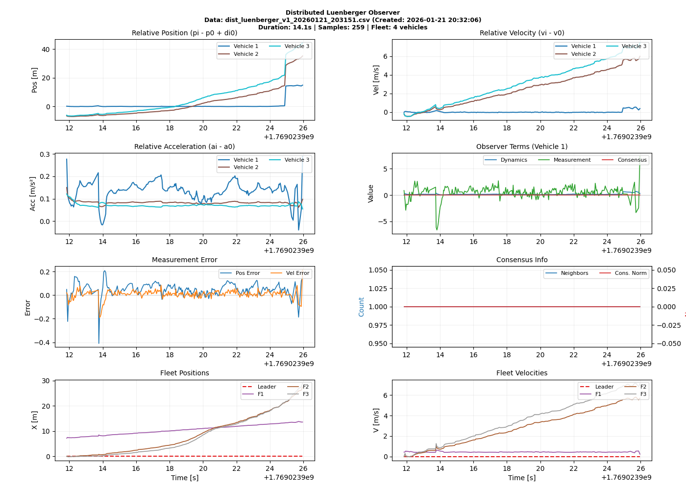
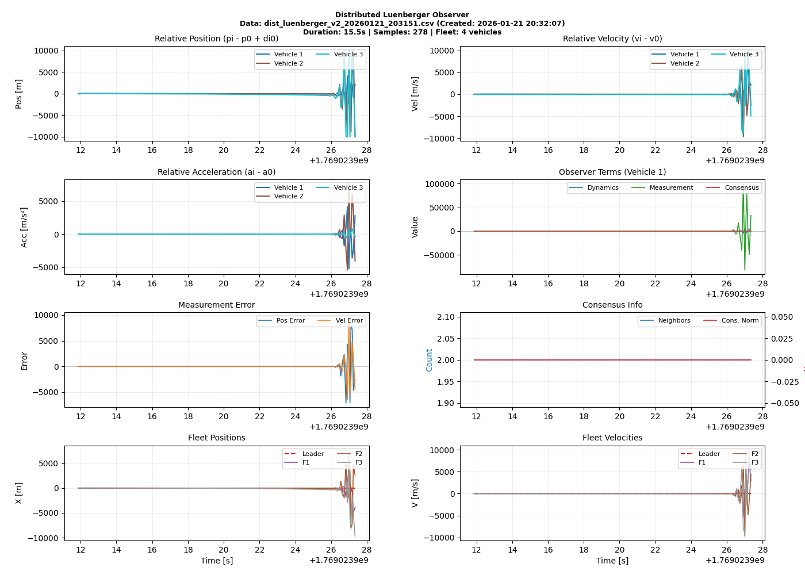
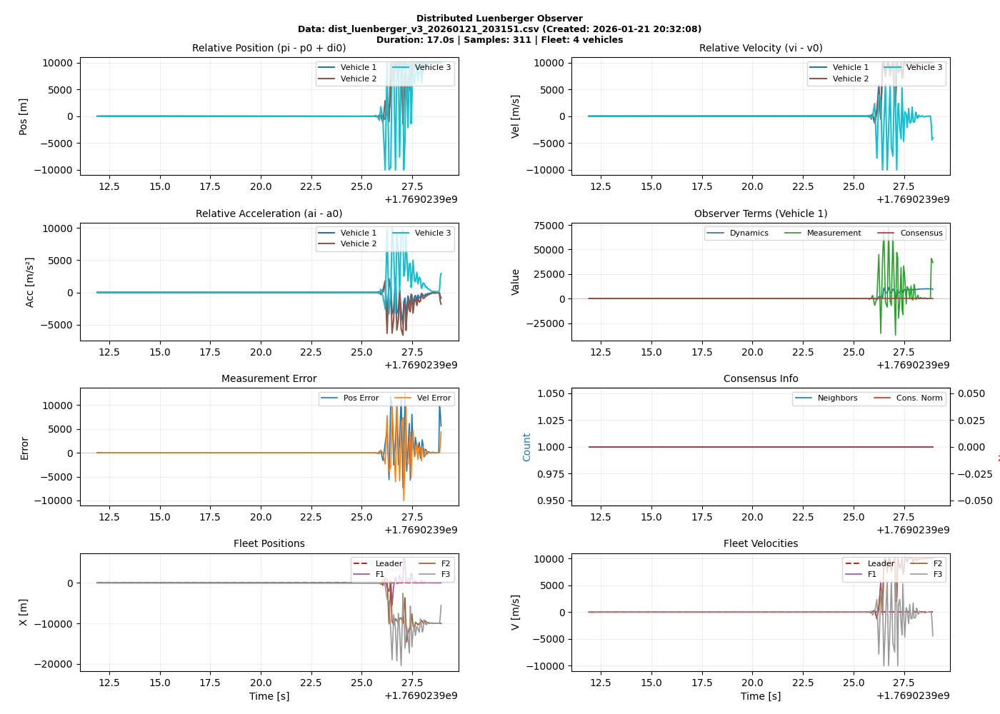

# Update Log 2026/01/21 (Shengya)

- [x] Correct the transfermation
- [x] Modify the plot, make sure the latest dist_luenberger_.csv can be plotted
- [x] Modify the extral config file, make sure all the local observer is ekf

Now, the results are shown as following:








**Analysis**: Here, we set the consensus term == 0. So, the perfomance of distributed observer 1 make sence. Vehicle 3 shows similar catastrophic divergence as Vehicle 2. 


## Debug Process

The main update of the distributed observer:
```
x_i_new = x_vec + dt * (dynamics_term + measurement_term - consensus_term)
```
1. The measurement_term is correct, including the real local measurement. The observer gain is utilized well. 

2. For the dynamics_term of the vehicle 1
    1. The initial fleet state is correct, as shwon in the following：

        | fleet_x_0 | fleet_v_0 | fleet_x_1 | fleet_v_1 | fleet_x_2 | fleet_v_2 | fleet_x_3 | fleet_v_3 |
        |-----------|-----------|-----------|-----------|-----------|-----------|-----------|-----------|
        | 0         | 0         | 3.420902613 | 0.36795 | 0         | 0         | 0         | 0         |

    2. Checking the [_transfer_fleet_states_to_estimated_states](). At the initial time, Here the following value is not correct:

        | Variable | Value |
        |---|---|
        | x_vec_before_p1 | 0.23487455 |
        | x_vec_before_v1 | 0.002114917 |

        ** The correct results x_vec_before_p1 should be 0.4083, not 0.23487455 **

        ```
        x_vec_before_p1 = p1 - p0 + d10; 
        # p1 from the fleet data, is 3.420902613, vehicel id == i.  
        # p0 from recieved local data, is 4.1805. 
        # di0 = d + h * v1, v1 is from the fleet data, is 0.36795
        ```

        To fix this issue, add the di0 recording. 

        Test it again, the initial value of the vehicle 1 is correct, but for the vehicle 2 and 3, it is not correct.  

        - [x] Fix the source of vi during the di0, if k == vehicle id, because there is not own state in the received data, so, we use local state. 

        For the inital condition. Because we fixed the controller command, the velocity and accelarate of all the vehicle are the same. Therefore, the initial vi - v0 and ai - a0 should be zero. 

** Big issue of transfer from estimated state to fleet state. The calculation is wrong, definiely wrong! **

If we assume there is fucntion: Phi: fleet state---> estimated state

Then, the transfermation from estimated state to fleet state should be inv(Phi)


# Update Log 2026/01/20 (HUY)
- [x] Move all your observer to a folder called ShengyaObs
- [x] No need to config here when run the vehicle. All the config is in observer internal 
- [x] Move the extras config file in Development\multi_vehicle_self_driving_RealQcar\qcar\Observer\extra_configs 
- [x] You can run like normal , or run fake vehicle to test the observer (Look Quick_Start)
- [x] Add the plot function to plot the result of the observer. 


# Update Log 2026/01/19 (Shengya MENG)
- [x] Creat the [start_all_cars.ps1](start_all_cars.ps1) and [stop_all_cars.ps1](stop_all_cars.ps1) to start or stop all cars at the same time. 
- [x] Remove the fleet_state = local state
- [x] Move the Ci and neighbors list to the init
- [x] Modify the transfer function to make sure the di0 is the same.\
- [x] Add the numerical protection


## About the Consensus term, there are the following issues:
- The neighbor id is not correct. As shown in the following, the neighbor of car 3 is just vehicle 2, not neighbor = 1. First, check the neighbor's index and the function to get the neighbor
```
2026-01-19 11:56:57 - [Car Car_3] - INFO - _distributed_luenberger_observer_update:1197 - Vehicle 3: Final consensus term applied, neighbors=1, norm=32682552589554365699139732780980633600.0000
```
- The result neighbor_x_vec - x_vec is too large, as shwon in the above, norm = 2682552589554365699139732780980633600.0000. First, check the dictionary of the neigbors state from _get_latest_received_state


# Update Log 2026/01/10 (Shengya MENG)

In the data log, there is 

| time | sender_id | source | col4 | col5 | vehicle id | x | y | theta | velocity | accelerate | confidence |
|---:|---:|:---|---:|---:|---:|---:|---:|---:|---:|---:|---:|
| 15.71526504 | 3 | fleet_consensus | 77 | 439500 | 0 | 0 | 0 | 0 | 0 | 0 | 0.8 |
| 15.71527910 | 3 | fleet_consensus | 77 | 439500 | 1 | -1.955082342 | 0 | 0 | 0 | 0.08777936 | 0.8 |
| 15.71528196 | 3 | fleet_consensus | 77 | 439500 | 2 | -1.319428368 | 0 | 0 | 0 | 0.096147887 | 0.8 |
| 15.71528411 | 3 | fleet_consensus | 77 | 439500 | 3 | -3.382616058 | -0.621174042 | -0.014103457 | 0 | 0.042212872 | 1 |

Here, if the vehicle id == sender id, the fleet estimate is from the local state. It is not reasonable. fleet estimate should just come from the distributed observer. But the local state is used to get the measurement. So it is better used it but not add it in the fleet estimate. 

- [ ] Make sure there is no local state in the fleet estimate. 
- [ ] Check why the position is alway negtiva.  

# Update Log 2026/01/08 (Shengya MENG)
- [ ] Check the reason why the fleet state is **nan** in the log. And fix it. 
- [x] Fixed the one reason causing nan. Correct the discrete update. But it **still diffuse**. 
```
x_i_new = x_vec + dt * (dynamics_term + measurement_term - consensus_term)
```
- [x]Fixed the following warning. It is beacuse we start or stop the car at the different time. 
```
2026-01-08 16:50:53 - [Car Car_1] - WARNING - _distributed_luenberger_observer_update:1107 - Vehicle 1: Using fallback strategy for neighbor 2

2026-01-08 16:50:09 - [Car Car_2] - WARNING - _distributed_luenberger_observer_update:995 - Vehicle 2: No recent leader state of the leader 0, using current estimate
```


## What I did and what I got

### Setting the observer state always be 0
```
x_i_new = np.zeros_like(dynamics_term)  # Testing without update first.
```
- The data log file seems correct. Not diffuse. Means **The communication is no problem**
- the log of each vehicle can hadle the fleet state message correctly, like 
```
2026-01-08 11:23:28 - [Car Car_3] - INFO - _handle_fleet_state_message:440 -     vehicle_0: x=0.000, y=0.000, theta=0.000, v=0.000, conf=0.80
```
- But in the log file of vehicle 1 and vehicle 2, there is no fleet data got from the neighbor, like 
```
2026-01-08 11:23:33 - [Car Car_1] - WARNING - _distributed_luenberger_observer_update:1102 - Vehicle 1: No fleet_state from neighbor 2, building from scratch
```

**The Nan maybe from the "get the fleet data from the communication"**

**Or the algrithem, if the gain is applied corretly?**


# Update Log 2026/01/07 (Shengya MENG)
- [x] Transfer the fleet state to be distributed observer state. [_transfer_estimated_states_to_fleet_states function_](../qcar/Observer/fleet_state_estimators.py)
- [x]Config the communication network, in my own distributed observer. [get_neighbors](../qcar/Observer/fleet_state_estimators.py). In the log of each vehicle, it is configed correctly. 
- [ ] Check the reason why the fleet state is **nan** in the log. And fix it. 


# Update Log 2026/01/06 (Shengya Meng)
- [x] Transfer the estimated state from the distributed observer to be fleet state. [_transfer_estimated_states_to_fleet_states function_](../qcar/Observer/fleet_state_estimators.py)
    - The estimated state from the distributed observer and fleet state have different meanings.
    - Implemented the conversion method to map the distributed observer's estimated state to the fleet state format.
    - Clarified that pi-1 and di0 should be sourced from local data for accurate calculations.
- [x] Change the config file [carx.yaml](../configs/car0.yaml) to be first config file higher priority than [fleet_config.yaml](../configs/fleet_config.yaml). Modified `VehicleObserverSimple` to log observer configuration upon initialization for better debugging and tracking.
- [x] Remove the manual setting  of the initial location of each vehicle in `initPlatoon.py`. Instead, set the initial distance between vehicles and calculate their positions accordingly.

## ToDo List
- [ ] Config the **leader without distributed observer**. But keep it state in the fleet state. So that the followers can use it to calculate the relative position and velocity to the leader.
- [ ] Check the reason why the fleet state is **nan** in the log. And fix it. 
- [ ] Use fake vehicle to test.
- [ ] Get the latest control input from V2V messages
- [ ] get the latest relative position from sensors (Lidar/Camera)

# Update Log 2025/12/17 (Shengya Meng)
- [x] Test if the observer gain can be used correctly in the observer class
    - local observer type can be applied. 

## ToDo List
- [ ] Make a logs for observer , local and fleet 
- [ ] Distinguiwish the observer gain for local observer and distributed osberver

# Update Log 2025/12/16 (Shengya Meng)
- Added `initPlatoon.py` to create platoons with variable sizes.
- Enabled observer configuration via external setting files (see details below).
- Added `DistributedLuenbergerEstimator` in `fleet_state_estimators.py`.

## ToDo List
- [ ] Test if the observer gain can be used correctly in the observer class;
- [ ] Make a logs for observer , local and fleet 


## Observer config flow (summary)

- `config_main.py` now defines `ObserverConfig`, so YAML/JSON `observer` blocks load into `config.observer` with defaults (types and gains always present).
- `VehicleObserverSimple._get_observer_config` merges external observer settings with defaults and accepts scalar/vector/matrix values for `observer_gain` and `consensus_gain`.
- `VehicleLogic` should read `config.observer` when constructing `VehicleObserver`, so per-vehicle `local_estimator_type` and `fleet_estimator_type` from `configs/carX.yaml` take effect instead of hardcoded defaults.
- `_create_fleet_estimator` forwards gains from `self.observer_config` to `FleetEstimatorFactory`; fleet estimators in `fleet_state_estimators.py` consume these values on construction.

## Example run

```bash
python vehicle_main.py --car-id 0 --config configs/car0.yaml
```
